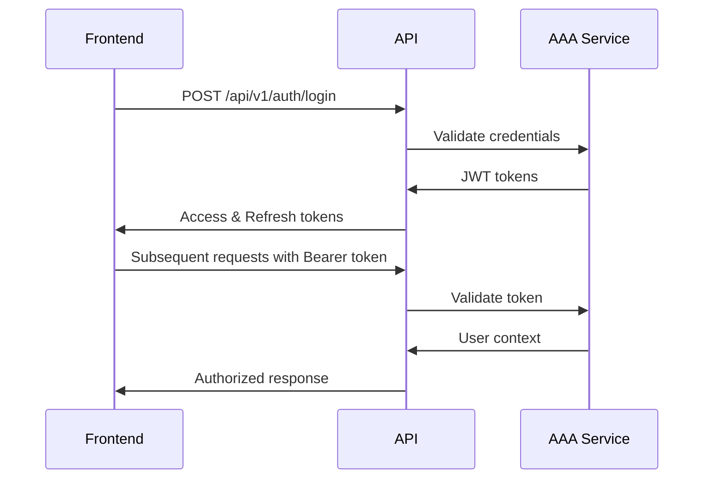

# KisanLink E-Commerce Frontend Integration Plan

## Executive Summary

This document provides a comprehensive integration plan for connecting frontend applications with the KisanLink E-Commerce backend API. The backend is built with Go, Gin framework, and integrates with an AAA (Authentication, Authorization, and Accounting) service for secure access control.

## 1. API Overview

### Base Configuration

- **Base URL**: `http://localhost:8080/api/v1` (development)
- **Documentation**: `/docs` (Scalar API Reference)
- **Swagger Spec**: `/docs/swagger.json`
- **Health Check**: `/health`
- **Metrics**: `/metrics`

### Key Features

- RESTful API design
- JWT-based authentication via AAA service
- CORS enabled for cross-origin requests
- Request ID tracking for debugging
- Comprehensive error handling with structured responses

## 2. Authentication & Authorization

### Authentication Flow



### Implementation Steps

1. **Login Request**

```javascript
const login = async (username, password) => {
  const response = await fetch(`${API_BASE}/auth/login`, {
    method: "POST",
    headers: { "Content-Type": "application/json" },
    body: JSON.stringify({ username, password }),
  });
  const data = await response.json();
  // Store tokens securely
  localStorage.setItem("access_token", data.access_token);
  localStorage.setItem("refresh_token", data.refresh_token);
  return data;
};
```

2. **Authenticated Requests**

```javascript
const authenticatedFetch = async (url, options = {}) => {
  const token = localStorage.getItem("access_token");
  return fetch(url, {
    ...options,
    headers: {
      ...options.headers,
      Authorization: `Bearer ${token}`,
      "Content-Type": "application/json",
    },
  });
};
```

### User Context Structure

```typescript
interface UserContext {
  userID: string;
  username: string;
  email: string;
  organizationID: string;
  organizationName: string;
  roles: string[];
  permissions: string[];
  isActive: boolean;
}
```

## 3. Core API Modules

### 3.1 Catalog Management

**Endpoints:**

- `GET /api/v1/catalog` - List all catalog items
- `GET /api/v1/catalog/search` - Search catalog
- `GET /api/v1/catalog/{type}` - List by type (PRODUCT/SERVICE/LABOUR)
- `PUT /api/v1/catalog/{type}/{id}` - Update catalog item

**Product-Specific:**

- `POST /api/v1/catalog/products` - Create product
- `GET /api/v1/catalog/products` - List products
- `GET /api/v1/catalog/products/{id}` - Get product details
- `PUT /api/v1/catalog/products/{id}` - Update product
- `DELETE /api/v1/catalog/products/{id}` - Delete product

**Data Models:**

```typescript
interface CatalogItem {
  id: string;
  organizationID: string;
  itemType: "PRODUCT" | "SERVICE" | "LABOUR";
  category: string;
  subcategory?: string;
  name: string;
  description: string;
  sku: string;
  unitOfMeasure: string;
  basePrice: number;
  currency: string;
  isActive: boolean;
  visibility: "PRIVATE" | "ORG" | "NETWORK" | "PUBLIC";
  tags: string[];
  attributes: Record<string, any>;
  images: string[];
}

interface Product extends CatalogItem {
  weight?: number;
  dimensions?: {
    length: number;
    width: number;
    height: number;
  };
  perishable: boolean;
  shelfLifeDays?: number;
}
```

### 3.2 Order Management

**Endpoints:**

- `POST /api/v1/orders` - Create order
- `GET /api/v1/orders` - List orders
- `GET /api/v1/orders/{id}` - Get order details
- `PUT /api/v1/orders/{id}` - Update order
- `PATCH /api/v1/orders/{id}/status` - Update order status
- `POST /api/v1/orders/{id}/cancel` - Cancel order

**Order Status Flow:**

```
pending → confirmed → paid → shipped → delivered → completed
                         ↓
                    cancelled → refunded
```

**Data Models:**

```typescript
interface Order {
  id: string;
  orderNumber: string;
  status: OrderStatus;
  buyerOrganizationID: string;
  sellerOrganizationID: string;
  buyerUserID: string;
  subtotalAmount: number;
  taxAmount: number;
  discountAmount: number;
  shippingAmount: number;
  totalAmount: number;
  shippingAddress: Address;
  estimatedDeliveryDate?: Date;
  actualDeliveryDate?: Date;
  notes?: string;
  items: OrderItem[];
  statusHistory: OrderStatusHistory[];
}

interface OrderItem {
  catalogItemID: string;
  catalogItemType: string;
  quantity: number;
  unitPrice: number;
  discountAmount: number;
  taxAmount: number;
  totalAmount: number;
}
```

### 3.3 Inventory Management

**Endpoints:**

- `POST /api/v1/inventory/lots` - Create inventory lot
- `GET /api/v1/inventory/lots` - List inventory lots
- `GET /api/v1/inventory/lots/{id}` - Get lot details
- `PATCH /api/v1/inventory/lots/{id}` - Update lot
- `PATCH /api/v1/inventory/lots/{id}/adjust` - Adjust quantity
- `GET /api/v1/inventory/lots/{id}/audit` - Get audit trail
- `GET /api/v1/inventory/availability/{catalog_item_id}` - Check availability

**Data Models:**

```typescript
interface InventoryLot {
  id: string;
  catalogItemID: string;
  locationID: string;
  quantity: number;
  reservedQuantity: number;
  availableQuantity: number;
  unitCost: number;
  batchNumber?: string;
  expiryDate?: Date;
  status: "available" | "reserved" | "expired" | "damaged";
}
```

### 3.4 Integration Services

**Endpoints:**

- `POST /api/v1/integrations/catalog/proposals` - Submit catalog proposal
- `GET /api/v1/integrations/catalog/exports` - Export catalog
- `POST /api/v1/integrations/orders/acknowledgements` - Acknowledge order
- `POST /api/v1/integrations/webhooks/validate` - Validate webhook
- `GET /api/v1/integrations/proposals/{id}/status` - Get proposal status
- `GET /api/v1/integrations/partners` - List integration partners

## 4. Frontend Implementation Strategy

### 4.1 Technology Recommendations

**Option 1: React + TypeScript (Recommended)**

```json
{
  "dependencies": {
    "react": "^18.0.0",
    "typescript": "^5.0.0",
    "axios": "^1.6.0",
    "react-query": "^3.39.0",
    "zustand": "^4.4.0",
    "react-router-dom": "^6.20.0",
    "antd": "^5.12.0"
  }
}
```

**Option 2: Next.js (Full-Stack)**

```json
{
  "dependencies": {
    "next": "^14.0.0",
    "typescript": "^5.0.0",
    "swr": "^2.2.0",
    "@tanstack/react-query": "^5.0.0",
    "tailwindcss": "^3.3.0"
  }
}
```

### 4.2 State Management Architecture

```typescript
// Store structure
interface AppState {
  auth: {
    user: UserContext | null;
    tokens: {
      access: string;
      refresh: string;
    };
    isAuthenticated: boolean;
  };
  catalog: {
    items: CatalogItem[];
    filters: CatalogFilters;
    loading: boolean;
  };
  orders: {
    list: Order[];
    current: Order | null;
    loading: boolean;
  };
  inventory: {
    lots: InventoryLot[];
    availability: Map<string, number>;
  };
}
```

### 4.3 API Client Layer

```typescript
// api/client.ts
class APIClient {
  private baseURL: string;
  private getAuthHeader(): HeadersInit {
    const token = localStorage.getItem("access_token");
    return token ? { Authorization: `Bearer ${token}` } : {};
  }

  async request<T>(endpoint: string, options: RequestInit = {}): Promise<T> {
    const response = await fetch(`${this.baseURL}${endpoint}`, {
      ...options,
      headers: {
        "Content-Type": "application/json",
        ...this.getAuthHeader(),
        ...options.headers,
      },
    });

    if (!response.ok) {
      throw new APIError(response.status, await response.json());
    }

    return response.json();
  }
}

// api/services/catalog.service.ts
class CatalogService {
  constructor(private client: APIClient) {}

  async getProducts(filters?: ProductFilters): Promise<Product[]> {
    const params = new URLSearchParams(filters as any);
    return this.client.request(`/catalog/products?${params}`);
  }

  async createProduct(product: CreateProductDTO): Promise<Product> {
    return this.client.request("/catalog/products", {
      method: "POST",
      body: JSON.stringify(product),
    });
  }
}
```

### 4.4 Error Handling Strategy

```typescript
interface APIError {
  code: string;
  message: string;
  details?: any;
  timestamp: string;
}

class ErrorHandler {
  static handle(error: APIError): void {
    switch (error.code) {
      case "AUTH_EXPIRED":
        // Refresh token or redirect to login
        AuthService.refresh();
        break;
      case "PERMISSION_DENIED":
        // Show permission error
        NotificationService.error("You don't have permission");
        break;
      case "VALIDATION_ERROR":
        // Show validation errors
        FormService.showErrors(error.details);
        break;
      default:
        // Generic error handling
        NotificationService.error(error.message);
    }
  }
}
```

## 5. Security Considerations

### 5.1 Token Management

- Store tokens securely (HttpOnly cookies preferred)
- Implement token refresh mechanism
- Clear tokens on logout
- Handle token expiration gracefully

### 5.2 CORS Configuration

```javascript
// Current backend CORS settings (permissive)
const corsOptions = {
  origin: process.env.FRONTEND_URL || "http://localhost:3000",
  credentials: true,
  methods: ["GET", "POST", "PUT", "PATCH", "DELETE", "OPTIONS"],
  allowedHeaders: ["Content-Type", "Authorization"],
};
```

### 5.3 Request Security

- Always use HTTPS in production
- Implement request signing for sensitive operations
- Add CSRF protection for state-changing operations
- Validate all inputs on frontend before sending

## 6. Real-time Features (Future)

### 6.1 WebSocket Integration

```javascript
// WebSocket connection for real-time updates
const ws = new WebSocket("ws://localhost:8080/ws");

ws.onmessage = (event) => {
  const update = JSON.parse(event.data);
  switch (update.type) {
    case "ORDER_STATUS_CHANGED":
      updateOrderStatus(update.payload);
      break;
    case "INVENTORY_UPDATED":
      refreshInventory(update.payload);
      break;
  }
};
```

### 6.2 Event Types

- Order status updates
- Inventory changes
- Price updates
- New catalog items
- Integration notifications

## 7. Performance Optimization

### 7.1 Caching Strategy

```typescript
// React Query example
const useProducts = (filters?: ProductFilters) => {
  return useQuery({
    queryKey: ["products", filters],
    queryFn: () => CatalogService.getProducts(filters),
    staleTime: 5 * 60 * 1000, // 5 minutes
    cacheTime: 10 * 60 * 1000, // 10 minutes
  });
};
```

### 7.2 Pagination

```typescript
interface PaginationParams {
  page: number;
  pageSize: number;
  sortBy?: string;
  sortOrder?: "asc" | "desc";
}

interface PaginatedResponse<T> {
  data: T[];
  total: number;
  page: number;
  pageSize: number;
  totalPages: number;
}
```

### 7.3 Optimizations

- Implement virtual scrolling for large lists
- Use debouncing for search inputs
- Lazy load images and heavy components
- Bundle splitting for faster initial load

## 8. Development Workflow

### 8.1 Environment Setup

```bash
# Frontend setup
npm create vite@latest kisanlink-frontend -- --template react-ts
cd kisanlink-frontend
npm install

# Environment variables (.env)
VITE_API_BASE_URL=http://localhost:8080/api/v1
VITE_WS_URL=ws://localhost:8080/ws
```

### 8.2 Development Proxy

```javascript
// vite.config.ts
export default {
  server: {
    proxy: {
      "/api": {
        target: "http://localhost:8080",
        changeOrigin: true,
      },
    },
  },
};
```

### 8.3 Testing Strategy

```typescript
// Integration test example
describe("Catalog API", () => {
  it("should fetch products", async () => {
    const products = await CatalogService.getProducts();
    expect(products).toBeInstanceOf(Array);
    expect(products[0]).toHaveProperty("id");
  });

  it("should create product with auth", async () => {
    await AuthService.login("test", "password");
    const product = await CatalogService.createProduct({
      name: "Test Product",
      itemType: "PRODUCT",
      basePrice: 100,
    });
    expect(product.id).toBeDefined();
  });
});
```

## 9. Deployment Considerations

### 9.1 Build Configuration

```javascript
// Production build
const buildConfig = {
  apiUrl: process.env.REACT_APP_API_URL,
  sentryDSN: process.env.REACT_APP_SENTRY_DSN,
  analytics: process.env.REACT_APP_GA_ID,
};
```

### 9.2 CI/CD Pipeline

```yaml
# GitHub Actions example
name: Frontend Deploy
on:
  push:
    branches: [main]
jobs:
  build:
    runs-on: ubuntu-latest
    steps:
      - uses: actions/checkout@v2
      - name: Build
        run: |
          npm ci
          npm run build
      - name: Deploy
        run: |
          # Deploy to CDN/hosting service
```

### 9.3 Monitoring

- Implement error tracking (Sentry)
- Add performance monitoring
- Track API response times
- Monitor WebSocket connections

## 10. Migration Path for Existing Frontends

### Phase 1: Authentication Migration

1. Implement new auth flow alongside existing
2. Migrate user sessions gradually
3. Update token storage mechanism
4. Remove old auth code

### Phase 2: API Migration

1. Create adapter layer for API differences
2. Migrate endpoints one by one
3. Update state management
4. Remove legacy API calls

### Phase 3: Feature Enhancement

1. Add real-time updates
2. Implement advanced filtering
3. Add offline support
4. Optimize performance

## Appendix A: Quick Start Guide

```bash
# 1. Clone frontend template
git clone <frontend-template-repo>
cd kisanlink-frontend

# 2. Install dependencies
npm install

# 3. Configure environment
cp .env.example .env.local
# Edit .env.local with your API URL

# 4. Start development server
npm run dev

# 5. Test authentication
# Navigate to http://localhost:3000/login
```

## Appendix B: Common Integration Patterns

### B.1 Product Listing with Filters

```typescript
const ProductList = () => {
  const [filters, setFilters] = useState<ProductFilters>({
    category: '',
    minPrice: 0,
    maxPrice: 1000,
  });

  const { data: products, loading } = useProducts(filters);

  return (
    <div>
      <FilterPanel onChange={setFilters} />
      {loading ? (
        <Spinner />
      ) : (
        <ProductGrid products={products} />
      )}
    </div>
  );
};
```

### B.2 Order Creation Flow

```typescript
const CreateOrder = () => {
  const [cart, setCart] = useState<CartItem[]>([]);

  const handleSubmit = async () => {
    const order = await OrderService.create({
      items: cart.map((item) => ({
        catalogItemID: item.id,
        quantity: item.quantity,
      })),
      shippingAddress: getShippingAddress(),
    });

    navigate(`/orders/${order.id}`);
  };
};
```

### B.3 Inventory Check

```typescript
const ProductDetail = ({ productId }) => {
  const { data: availability } = useInventoryAvailability(productId);

  return (
    <div>
      <ProductInfo />
      <AvailabilityBadge
        available={availability?.quantity || 0}
        status={availability?.status}
      />
      <AddToCartButton
        disabled={!availability?.quantity}
      />
    </div>
  );
};
```

## Conclusion

This integration plan provides a comprehensive roadmap for connecting frontend applications with the KisanLink E-Commerce backend. The modular architecture and clear API contracts enable flexible frontend development while maintaining security and performance standards.

For questions or clarifications, please refer to the API documentation at `/docs` or contact the backend development team.
