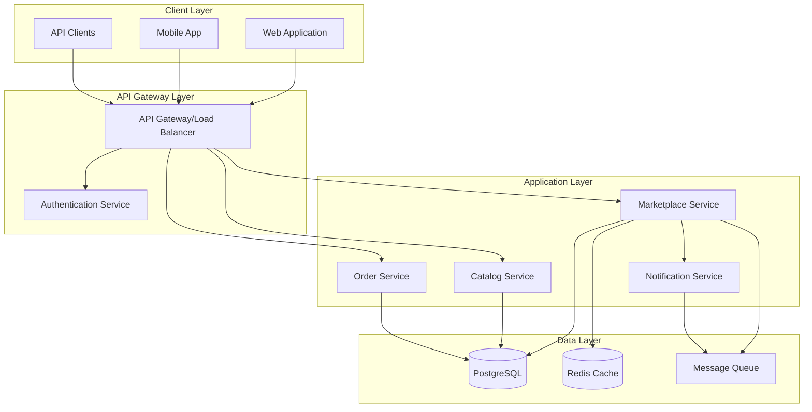

# Design Document

## Overview

The KisanLink Bidding Marketplace System is designed as a microservice-based auction platform that integrates with the existing KisanLink e-commerce infrastructure. The system follows a layered architecture pattern with clear separation of concerns between presentation, business logic, and data persistence layers. The design emphasizes real-time auction management, concurrent bid processing, and seamless integration with existing catalog and order management systems.

## Architecture

### High-Level Architecture



### Service Architecture

The bidding marketplace functionality will be implemented as extensions to the existing KisanLink e-commerce service, following the established patterns:

- **Handlers Layer**: REST API endpoints for marketplace operations
- **Services Layer**: Business logic for auctions, bidding, and lifecycle management
- **Repository Layer**: Data access patterns for marketplace entities
- **Models Layer**: Domain entities for listings, bids, and auction states

## Components and Interfaces

### Core Components

#### 1. Marketplace Handler (`internal/handlers/marketplace/`)

**Responsibilities:**

- Handle HTTP requests for marketplace operations
- Validate request data and authentication
- Coordinate with marketplace services
- Return structured API responses

**Key Endpoints:**

```go
// Listing Management
POST   /api/v1/marketplace/listings
GET    /api/v1/marketplace/listings
GET    /api/v1/marketplace/listings/{id}
PUT    /api/v1/marketplace/listings/{id}
DELETE /api/v1/marketplace/listings/{id}
POST   /api/v1/marketplace/listings/{id}/close

// Bidding Operations
POST   /api/v1/marketplace/listings/{id}/bids
GET    /api/v1/marketplace/listings/{id}/bids
GET    /api/v1/marketplace/bids/{id}
GET    /api/v1/marketplace/bids/my-bids

// Admin Operations
GET    /api/v1/admin/marketplace/listings
DELETE /api/v1/admin/marketplace/bids/{id}
POST   /api/v1/admin/marketplace/listings/{id}/force-close
```

#### 2. Marketplace Service (`internal/services/marketplace/`)

**Responsibilities:**

- Implement auction business logic
- Manage bid processing and validation
- Handle auction lifecycle events
- Coordinate with external services

**Key Interfaces:**

```go
type MarketplaceService interface {
    // Listing Management
    CreateListing(ctx context.Context, req *CreateListingRequest) (*Listing, error)
    GetListing(ctx context.Context, listingID string) (*Listing, error)
    GetActiveListings(ctx context.Context, filters ListingFilters) (*ListingPage, error)
    CloseListing(ctx context.Context, listingID string, reason CloseReason) (*ClosedListing, error)

    // Bidding Operations
    PlaceBid(ctx context.Context, req *PlaceBidRequest) (*Bid, error)
    GetBidHistory(ctx context.Context, listingID string, pagination Pagination) (*BidPage, error)
    GetUserBids(ctx context.Context, userID string, filters BidFilters) (*BidPage, error)

    // Auction Management
    ProcessExpiredAuctions(ctx context.Context) error
    HandleAutoBidding(ctx context.Context, listingID string, newBid *Bid) error
}
```

#### 3. Auction Engine (`internal/services/marketplace/auction_engine.go`)

**Responsibilities:**

- Process concurrent bids atomically
- Manage auto-bidding logic
- Handle auction state transitions
- Ensure data consistency during high-concurrency scenarios

**Key Features:**

- Distributed locking for bid processing
- Event-driven auction state management
- Real-time bid validation and ranking
- Automatic auction closure scheduling

#### 4. Repository Layer (`internal/repositories/marketplace/`)

**Responsibilities:**

- Data persistence for marketplace entities
- Optimized queries for auction operations
- Transaction management for bid processing
- Audit trail maintenance

**Key Interfaces:**

```go
type ListingRepository interface {
    Create(ctx context.Context, listing *Listing) error
    GetByID(ctx context.Context, id string) (*Listing, error)
    GetActive(ctx context.Context, filters ListingFilters) ([]*Listing, error)
    Update(ctx context.Context, listing *Listing) error
    GetExpired(ctx context.Context) ([]*Listing, error)
}

type BidRepository interface {
    Create(ctx context.Context, bid *Bid) error
    GetByID(ctx context.Context, id string) (*Bid, error)
    GetByListing(ctx context.Context, listingID string, pagination Pagination) ([]*Bid, error)
    GetByUser(ctx context.Context, userID string, filters BidFilters) ([]*Bid, error)
    GetHighestBid(ctx context.Context, listingID string) (*Bid, error)
    UpdateStatus(ctx context.Context, bidID string, status BidStatus) error
}
```

## Data Models

### Core Entities

#### Listing Entity

```go
type Listing struct {
    base.BaseModel

    // Basic Information
    ListingID       string    `json:"listing_id" db:"listing_id"`
    ProductID       string    `json:"product_id" db:"product_id"`
    SellerID        string    `json:"seller_id" db:"seller_id"`
    OrganizationID  string    `json:"organization_id" db:"organization_id"`

    // Auction Parameters
    Quantity        float64   `json:"quantity" db:"quantity"`
    AskingPrice     float64   `json:"asking_price" db:"asking_price"`
    MinimumBid      float64   `json:"minimum_bid" db:"minimum_bid"`
    Currency        string    `json:"currency" db:"currency"`

    // Timing
    ListingDuration int       `json:"listing_duration_hours" db:"listing_duration_hours"`
    ExpiresAt       time.Time `json:"expires_at" db:"expires_at"`

    // Status
    Status          ListingStatus `json:"status" db:"status"`
    CurrentHighestBidID *string   `json:"current_highest_bid_id" db:"current_highest_bid_id"`
    BidCount        int           `json:"bid_count" db:"bid_count"`

    // Visibility & Auction Configuration
    Visibility      ListingVisibility `json:"visibility" db:"visibility"`
    AuctionType     AuctionType       `json:"auction_type" db:"auction_type"`
    BidVisibility   BidVisibility     `json:"bid_visibility" db:"bid_visibility"`

    // Additional Details
    PickupLocation  *Location `json:"pickup_location" db:"pickup_location"`
    TermsConditions string    `json:"terms_conditions" db:"terms_conditions"`
    ListingType     string    `json:"listing_type" db:"listing_type"`

    // Audit
    ClosedAt        *time.Time `json:"closed_at" db:"closed_at"`
    CloseReason     *string    `json:"close_reason" db:"close_reason"`
}

type ListingStatus string
const (
    ListingStatusActive     ListingStatus = "ACTIVE"
    ListingStatusClosed     ListingStatus = "CLOSED"
    ListingStatusExpired    ListingStatus = "EXPIRED"
    ListingStatusCancelled  ListingStatus = "CANCELLED"
)

type ListingVisibility string
const (
    VisibilityPrivate      ListingVisibility = "PRIVATE"      // Only invited participants
    VisibilityPublic       ListingVisibility = "PUBLIC"       // Open to all users
    VisibilityNetwork      ListingVisibility = "NETWORK"      // Network/partner organizations
    VisibilityOrganization ListingVisibility = "ORGANIZATION" // Same organization only
)

type AuctionType string
const (
    AuctionTypeOpen   AuctionType = "OPEN"   // All bid prices visible during auction
    AuctionTypeClosed AuctionType = "CLOSED" // Bid prices hidden until auction ends
)

type BidVisibility string
const (
    BidVisibilityFull     BidVisibility = "FULL"     // Show all bid details based on auction type
    BidVisibilityPartial  BidVisibility = "PARTIAL"  // Show bid count and highest amount only
    BidVisibilityMinimal  BidVisibility = "MINIMAL"  // Show only bid count
    BidVisibilityHidden   BidVisibility = "HIDDEN"   // No bid information visible
)
```

#### Bid Entity

```go
type Bid struct {
    base.BaseModel

    // Basic Information
    BidID       string  `json:"bid_id" db:"bid_id"`
    ListingID   string  `json:"listing_id" db:"listing_id"`
    BidderID    string  `json:"bidder_id" db:"bidder_id"`

    // Bid Details
    BidAmount   float64 `json:"bid_amount" db:"bid_amount"`
    Currency    string  `json:"currency" db:"currency"`
    Quantity    float64 `json:"quantity" db:"quantity"`
    Message     string  `json:"message" db:"message"`

    // Auto-bidding
    AutoBidLimit    *float64 `json:"auto_bid_limit" db:"auto_bid_limit"`
    IsAutoBid       bool     `json:"is_auto_bid" db:"is_auto_bid"`
    ParentBidID     *string  `json:"parent_bid_id" db:"parent_bid_id"`

    // Status
    Status          BidStatus `json:"status" db:"status"`
    IsHighestBid    bool      `json:"is_highest_bid" db:"is_highest_bid"`
    OutbidAt        *time.Time `json:"outbid_at" db:"outbid_at"`

    // Payment
    PaymentMethod   string `json:"payment_method" db:"payment_method"`

    // Audit
    PlacedAt        time.Time `json:"placed_at" db:"placed_at"`
}

type BidStatus string
const (
    BidStatusActive   BidStatus = "ACTIVE"
    BidStatusOutbid   BidStatus = "OUTBID"
    BidStatusWinning  BidStatus = "WINNING"
    BidStatusExpired  BidStatus = "EXPIRED"
    BidStatusRemoved  BidStatus = "REMOVED"
)
```

#### Auction Event Entity

```go
type AuctionEvent struct {
    base.BaseModel

    EventID     string          `json:"event_id" db:"event_id"`
    ListingID   string          `json:"listing_id" db:"listing_id"`
    EventType   AuctionEventType `json:"event_type" db:"event_type"`
    EventData   json.RawMessage `json:"event_data" db:"event_data"`
    ActorID     string          `json:"actor_id" db:"actor_id"`
    ActorType   string          `json:"actor_type" db:"actor_type"`
    Timestamp   time.Time       `json:"timestamp" db:"timestamp"`
}

type AuctionEventType string
const (
    EventListingCreated   AuctionEventType = "LISTING_CREATED"
    EventBidPlaced        AuctionEventType = "BID_PLACED"
    EventBidOutbid        AuctionEventType = "BID_OUTBID"
    EventAutoBidTriggered AuctionEventType = "AUTO_BID_TRIGGERED"
    EventListingClosed    AuctionEventType = "LISTING_CLOSED"
    EventListingExpired   AuctionEventType = "LISTING_EXPIRED"
)
```

### Database Schema

#### Tables Structure

```sql
-- Marketplace Listings
CREATE TABLE marketplace_listings (
    id UUID PRIMARY KEY DEFAULT gen_random_uuid(),
    listing_id VARCHAR(50) UNIQUE NOT NULL,
    product_id VARCHAR(50) NOT NULL,
    seller_id VARCHAR(50) NOT NULL,
    organization_id VARCHAR(50) NOT NULL,

    quantity DECIMAL(10,3) NOT NULL,
    asking_price DECIMAL(10,2) NOT NULL,
    minimum_bid DECIMAL(10,2) NOT NULL,
    currency VARCHAR(3) NOT NULL DEFAULT 'INR',

    listing_duration_hours INTEGER NOT NULL,
    expires_at TIMESTAMP NOT NULL,

    status VARCHAR(20) NOT NULL DEFAULT 'ACTIVE',
    current_highest_bid_id VARCHAR(50),
    bid_count INTEGER DEFAULT 0,

    visibility VARCHAR(20) NOT NULL DEFAULT 'PUBLIC',
    auction_type VARCHAR(10) NOT NULL DEFAULT 'OPEN',
    bid_visibility VARCHAR(20) NOT NULL DEFAULT 'FULL',

    pickup_location JSONB,
    terms_conditions TEXT,
    listing_type VARCHAR(20) DEFAULT 'AUCTION',

    closed_at TIMESTAMP,
    close_reason VARCHAR(50),

    created_at TIMESTAMP DEFAULT NOW(),
    updated_at TIMESTAMP DEFAULT NOW(),

    INDEX idx_listings_status (status),
    INDEX idx_listings_expires_at (expires_at),
    INDEX idx_listings_seller (seller_id),
    INDEX idx_listings_product (product_id)
);

-- Marketplace Bids
CREATE TABLE marketplace_bids (
    id UUID PRIMARY KEY DEFAULT gen_random_uuid(),
    bid_id VARCHAR(50) UNIQUE NOT NULL,
    listing_id VARCHAR(50) NOT NULL,
    bidder_id VARCHAR(50) NOT NULL,

    bid_amount DECIMAL(10,2) NOT NULL,
    currency VARCHAR(3) NOT NULL DEFAULT 'INR',
    quantity DECIMAL(10,3) NOT NULL,
    message TEXT,

    auto_bid_limit DECIMAL(10,2),
    is_auto_bid BOOLEAN DEFAULT FALSE,
    parent_bid_id VARCHAR(50),

    status VARCHAR(20) NOT NULL DEFAULT 'ACTIVE',
    is_highest_bid BOOLEAN DEFAULT FALSE,
    outbid_at TIMESTAMP,

    payment_method VARCHAR(50),
    placed_at TIMESTAMP DEFAULT NOW(),

    created_at TIMESTAMP DEFAULT NOW(),
    updated_at TIMESTAMP DEFAULT NOW(),

    FOREIGN KEY (listing_id) REFERENCES marketplace_listings(listing_id),
    INDEX idx_bids_listing (listing_id),
    INDEX idx_bids_bidder (bidder_id),
    INDEX idx_bids_status (status),
    INDEX idx_bids_highest (is_highest_bid),
    INDEX idx_bids_placed_at (placed_at)
);

-- Auction Events (for audit trail)
CREATE TABLE auction_events (
    id UUID PRIMARY KEY DEFAULT gen_random_uuid(),
    event_id VARCHAR(50) UNIQUE NOT NULL,
    listing_id VARCHAR(50) NOT NULL,
    event_type VARCHAR(50) NOT NULL,
    event_data JSONB,
    actor_id VARCHAR(50),
    actor_type VARCHAR(20),
    timestamp TIMESTAMP DEFAULT NOW(),

    INDEX idx_events_listing (listing_id),
    INDEX idx_events_type (event_type),
    INDEX idx_events_timestamp (timestamp)
);
```

## Visibility and Auction Configuration

### Listing Visibility Levels

The system supports four levels of listing visibility to control who can see and participate in auctions:

#### 1. Private Auctions (`PRIVATE`)

- Only specifically invited participants can view and bid
- Requires invitation mechanism with participant whitelist
- Seller controls participant list
- Highest security and exclusivity

#### 2. Public Auctions (`PUBLIC`)

- Open to all authenticated users on the platform
- Default visibility for most marketplace listings
- Maximum reach and participation
- Standard marketplace behavior

#### 3. Network Auctions (`NETWORK`)

- Visible to partner organizations and network members
- Requires network/partnership relationships
- Business-to-business focused auctions
- Controlled but broader than organization-only

#### 4. Organization Auctions (`ORGANIZATION`)

- Limited to users within the same organization
- Internal trading and resource allocation
- Organization-specific marketplace
- Maintains organizational boundaries

### Auction Types

#### Open Auctions (`OPEN`)

- All bid amounts and bidder counts are visible in real-time
- Participants can see current highest bid and bid history
- Transparent price discovery process
- Encourages competitive bidding through visibility

#### Closed Auctions (`CLOSED`)

- Bid amounts are hidden during the auction period
- Only bid count and participation status visible
- Final results revealed when auction closes
- Prevents bid anchoring and strategic manipulation

### Bid Visibility Configuration

Independent of auction type, bid visibility can be further controlled:

#### Full Visibility (`FULL`)

- Complete bid history with amounts and timestamps
- Bidder anonymity maintained (Anonymous Bidder #1, #2, etc.)
- Real-time updates of all bidding activity
- Maximum transparency for participants

#### Partial Visibility (`PARTIAL`)

- Shows current highest bid amount and total bid count
- No individual bid history visible
- Balanced information for decision making
- Reduces information overload

#### Minimal Visibility (`MINIMAL`)

- Only shows total number of bids placed
- No bid amounts visible during auction
- Minimal information for strategic bidding
- Focuses on participation rather than amounts

#### Hidden Visibility (`HIDDEN`)

- No bid information visible to participants
- Completely blind auction format
- Results only revealed at auction end
- Maximum privacy and anti-manipulation

### Visibility Matrix

| Auction Type | Bid Visibility | During Auction      | At Auction End      |
| ------------ | -------------- | ------------------- | ------------------- |
| OPEN         | FULL           | All bids visible    | Complete history    |
| OPEN         | PARTIAL        | Highest bid + count | Complete history    |
| OPEN         | MINIMAL        | Bid count only      | Complete history    |
| OPEN         | HIDDEN         | No bid info         | Winner only         |
| CLOSED       | FULL           | Bid count only      | Complete history    |
| CLOSED       | PARTIAL        | Bid count only      | Highest bid + count |
| CLOSED       | MINIMAL        | Bid count only      | Bid count only      |
| CLOSED       | HIDDEN         | No bid info         | Winner only         |

### Implementation Considerations

#### Access Control Logic

```go
func (s *MarketplaceService) GetBidHistory(ctx context.Context, listingID string, userID string) (*BidHistory, error) {
    listing, err := s.repo.GetListing(ctx, listingID)
    if err != nil {
        return nil, err
    }

    // Check visibility permissions
    if !s.canViewListing(ctx, listing, userID) {
        return nil, ErrListingNotVisible
    }

    // Apply bid visibility rules
    return s.applyBidVisibilityRules(ctx, listing, userID)
}

func (s *MarketplaceService) canViewListing(ctx context.Context, listing *Listing, userID string) bool {
    switch listing.Visibility {
    case VisibilityPrivate:
        return s.isInvitedParticipant(ctx, listing.ListingID, userID)
    case VisibilityPublic:
        return true
    case VisibilityNetwork:
        return s.isNetworkMember(ctx, listing.OrganizationID, userID)
    case VisibilityOrganization:
        return s.isSameOrganization(ctx, listing.OrganizationID, userID)
    default:
        return false
    }
}
```

#### Real-time Updates

- WebSocket connections for live bid updates
- Visibility-aware event filtering
- Participant-specific information delivery
- Efficient update mechanisms for different visibility levels

## Error Handling

### Error Categories

#### 1. Validation Errors

- Invalid bid amounts (below minimum, non-positive)
- Missing required fields in requests
- Invalid time durations or dates
- Malformed request data

#### 2. Business Logic Errors

- Bidding on own listings
- Bidding on expired auctions
- Insufficient inventory for listings
- Duplicate bid attempts

#### 3. Authorization Errors

- Invalid JWT tokens
- Insufficient permissions for operations
- Organization mismatch errors
- Role-based access violations

#### 4. System Errors

- Database connection failures
- External service unavailability
- Concurrent operation conflicts
- Resource exhaustion

### Error Response Structure

```go
type ErrorResponse struct {
    Success bool        `json:"success"`
    Error   ErrorDetail `json:"error"`
    Meta    *Meta       `json:"meta,omitempty"`
}

type ErrorDetail struct {
    Code    string      `json:"code"`
    Message string      `json:"message"`
    Details interface{} `json:"details,omitempty"`
}

// Specific error codes
const (
    ErrCodeValidation        = "VALIDATION_ERROR"
    ErrCodeBidTooLow        = "BID_TOO_LOW"
    ErrCodeListingExpired   = "LISTING_EXPIRED"
    ErrCodeCannotBidOwn     = "CANNOT_BID_OWN_LISTING"
    ErrCodeInsufficientInv  = "INSUFFICIENT_INVENTORY"
    ErrCodeUnauthorized     = "UNAUTHORIZED"
    ErrCodeForbidden        = "FORBIDDEN"
    ErrCodeNotFound         = "NOT_FOUND"
    ErrCodeConcurrencyError = "CONCURRENCY_ERROR"
    ErrCodeSystemError      = "SYSTEM_ERROR"
)
```

## Testing Strategy

### Unit Testing

- **Service Layer Tests**: Business logic validation, edge cases, error scenarios
- **Repository Tests**: Data access patterns, query optimization, transaction handling
- **Handler Tests**: Request/response validation, authentication, authorization
- **Model Tests**: Data validation, serialization, business rules

### Integration Testing

- **Database Integration**: End-to-end data flow, transaction consistency
- **Service Integration**: Cross-service communication, external API integration
- **Authentication Integration**: JWT validation, role-based access control
- **Cache Integration**: Redis operations, cache invalidation strategies

### End-to-End Testing

- **Complete Auction Workflows**: Listing creation through order generation
- **Concurrent Bidding Scenarios**: Race condition handling, data consistency
- **Time-based Operations**: Auction expiry, automatic closures
- **Error Recovery**: System resilience, graceful degradation

### Performance Testing

- **Load Testing**: High-volume concurrent bidding scenarios
- **Stress Testing**: System limits, resource exhaustion scenarios
- **Scalability Testing**: Database performance under load
- **Response Time Testing**: API endpoint performance benchmarks

### Test Data Management

```go
// Test fixtures for consistent testing
type TestFixtures struct {
    Products    []*catalog.Product
    Users       []*user.User
    Listings    []*Listing
    Bids        []*Bid
    Organizations []*Organization
}

// Test utilities for setup and cleanup
type TestUtils struct {
    DB          *sql.DB
    Cache       *redis.Client
    AuthClient  *auth.MockClient
    TimeService *MockTimeService
}
```

### Automated Testing Pipeline

- **Pre-commit Hooks**: Unit tests, linting, formatting
- **CI/CD Integration**: Automated test execution on code changes
- **Test Coverage**: Minimum 90% overall coverage, 80% branch coverage
- **Performance Benchmarks**: Automated performance regression detection

## Security Considerations

### Authentication & Authorization

- JWT token validation for all marketplace operations
- Role-based access control (Admin, Lister, Buyer)
- Organization-level data isolation
- API rate limiting to prevent abuse

### Data Protection

- Input sanitization and validation
- SQL injection prevention through parameterized queries
- XSS protection in API responses
- Sensitive data encryption at rest

### Audit Trail

- Complete auction event logging
- User action tracking
- Administrative operation logging
- Compliance reporting capabilities

### Fraud Prevention

- Bid pattern analysis for suspicious activity
- User reputation tracking
- Automated fraud detection rules
- Manual review workflows for high-value transactions

This design provides a comprehensive foundation for implementing the bidding marketplace system while maintaining consistency with the existing KisanLink e-commerce architecture and ensuring scalability, security, and maintainability.
