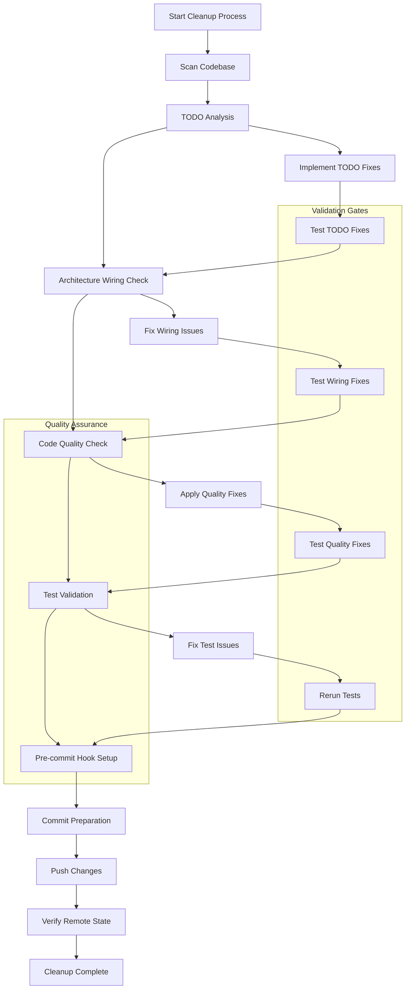
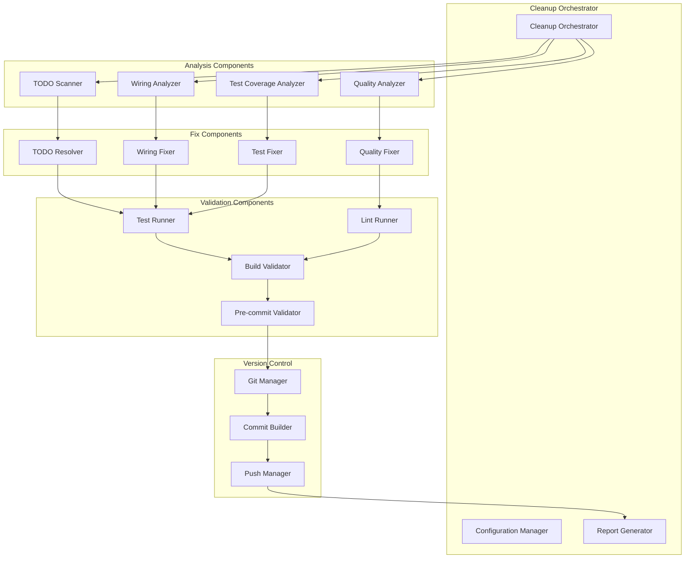

# Code Cleanup and Finalization - Design Document

## Overview

The Code Cleanup and Finalization system provides a comprehensive approach to preparing the KisanLink E-commerce Service codebase for production deployment. This design outlines the systematic process for identifying and resolving technical debt, ensuring architectural integrity, enforcing code quality standards, and maintaining version control best practices. The system operates as a multi-phase cleanup process that validates, fixes, tests, and commits all changes while preserving functionality and maintaining high code quality standards.

## Architecture

### Cleanup Process Flow



### Component Architecture



## Components and Interfaces

### Core Components

#### 1. Cleanup Orchestrator

```go
type CleanupOrchestrator interface {
    ExecuteCleanup(ctx context.Context, config CleanupConfig) (*CleanupReport, error)
    ValidatePrerequisites(ctx context.Context) error
    GenerateReport(ctx context.Context, results []CleanupResult) (*CleanupReport, error)
}

type CleanupConfig struct {
    TargetDirectory     string
    SkipTodos          bool
    SkipWiring         bool
    SkipQuality        bool
    SkipTests          bool
    SkipCommit         bool
    TestCoverageTarget float64
    CommitMessage      string
    PushToRemote       bool
}

type CleanupReport struct {
    StartTime           time.Time
    EndTime             time.Time
    TodosResolved       int
    WiringIssuesFixed   int
    QualityIssuesFixed  int
    TestsAdded          int
    TestCoverage        float64
    CommitHash          string
    Success             bool
    Errors              []error
}
```

#### 2. TODO Scanner and Resolver

```go
type TodoScanner interface {
    ScanForTodos(ctx context.Context, directory string) ([]TodoItem, error)
    AnalyzeTodoComplexity(todo TodoItem) TodoComplexity
    GenerateTodoReport(todos []TodoItem) TodoReport
}

type TodoResolver interface {
    ResolveTodo(ctx context.Context, todo TodoItem) (*TodoResolution, error)
    ValidateResolution(ctx context.Context, resolution TodoResolution) error
    ApplyResolution(ctx context.Context, resolution TodoResolution) error
}

type TodoItem struct {
    FilePath    string
    LineNumber  int
    Content     string
    Type        TodoType // TODO, FIXME, HACK, NOTE
    Complexity  TodoComplexity
    Context     string
    Suggestions []string
}

type TodoComplexity string

const (
    TodoComplexitySimple   TodoComplexity = "simple"   // Remove comment or simple fix
    TodoComplexityModerate TodoComplexity = "moderate" // Implement missing function
    TodoComplexityComplex  TodoComplexity = "complex"  // Requires design decision
)

type TodoResolution struct {
    TodoItem     TodoItem
    Action       TodoAction
    Implementation string
    TestsRequired bool
    Documentation string
}

type TodoAction string

const (
    TodoActionRemove    TodoAction = "remove"    // Remove obsolete comment
    TodoActionImplement TodoAction = "implement" // Implement missing functionality
    TodoActionDocument  TodoAction = "document"  // Convert to proper documentation
    TodoActionIssue     TodoAction = "issue"     // Create issue for future work
)
```

#### 3. Wiring Analyzer and Fixer

```go
type WiringAnalyzer interface {
    AnalyzeRouteWiring(ctx context.Context, routesDir string) ([]WiringIssue, error)
    AnalyzeHandlerWiring(ctx context.Context, handlersDir string) ([]WiringIssue, error)
    AnalyzeServiceWiring(ctx context.Context, servicesDir string) ([]WiringIssue, error)
    AnalyzeRepositoryWiring(ctx context.Context, reposDir string) ([]WiringIssue, error)
    ValidateEndToEndFlow(ctx context.Context, endpoint string) (*FlowValidation, error)
}

type WiringFixer interface {
    FixWiringIssue(ctx context.Context, issue WiringIssue) (*WiringFix, error)
    ValidateWiringFix(ctx context.Context, fix WiringFix) error
    ApplyWiringFix(ctx context.Context, fix WiringFix) error
}

type WiringIssue struct {
    Type        WiringIssueType
    Component   string
    FilePath    string
    LineNumber  int
    Description string
    Severity    WiringSeverity
    Suggestions []string
}

type WiringIssueType string

const (
    WiringIssueUnconnectedRoute   WiringIssueType = "unconnected_route"
    WiringIssueUnusedHandler      WiringIssueType = "unused_handler"
    WiringIssueMissingService     WiringIssueType = "missing_service"
    WiringIssueUninjectedRepo     WiringIssueType = "uninjected_repository"
    WiringIssueBrokenFlow         WiringIssueType = "broken_flow"
)

type WiringSeverity string

const (
    WiringSeverityCritical WiringSeverity = "critical" // Breaks functionality
    WiringSeverityMajor    WiringSeverity = "major"    // Impacts features
    WiringSeverityMinor    WiringSeverity = "minor"    // Code quality issue
)

type FlowValidation struct {
    Endpoint    string
    RouteExists bool
    HandlerExists bool
    ServiceExists bool
    RepositoryExists bool
    FlowComplete bool
    Issues      []WiringIssue
}
```

#### 4. Quality Analyzer and Fixer

```go
type QualityAnalyzer interface {
    RunGofmt(ctx context.Context, directory string) ([]QualityIssue, error)
    RunGolangciLint(ctx context.Context, directory string) ([]QualityIssue, error)
    CheckImports(ctx context.Context, directory string) ([]QualityIssue, error)
    ValidateErrorHandling(ctx context.Context, directory string) ([]QualityIssue, error)
    CheckCodeStructure(ctx context.Context, directory string) ([]QualityIssue, error)
}

type QualityFixer interface {
    FixQualityIssue(ctx context.Context, issue QualityIssue) (*QualityFix, error)
    ApplyQualityFix(ctx context.Context, fix QualityFix) error
    ValidateQualityFix(ctx context.Context, fix QualityFix) error
}

type QualityIssue struct {
    Type        QualityIssueType
    FilePath    string
    LineNumber  int
    Description string
    Severity    QualitySeverity
    AutoFixable bool
    Suggestion  string
}

type QualityIssueType string

const (
    QualityIssueFormatting     QualityIssueType = "formatting"
    QualityIssueLinting        QualityIssueType = "linting"
    QualityIssueImports        QualityIssueType = "imports"
    QualityIssueErrorHandling  QualityIssueType = "error_handling"
    QualityIssueStructure      QualityIssueType = "structure"
)

type QualitySeverity string

const (
    QualitySeverityError   QualitySeverity = "error"   // Must fix
    QualitySeverityWarning QualitySeverity = "warning" // Should fix
    QualitySeverityInfo    QualitySeverity = "info"    // Nice to fix
)
```

#### 5. Test Analyzer and Runner

```go
type TestAnalyzer interface {
    AnalyzeCoverage(ctx context.Context, directory string) (*CoverageReport, error)
    FindMissingTests(ctx context.Context, directory string) ([]MissingTest, error)
    ValidateTestQuality(ctx context.Context, directory string) ([]TestQualityIssue, error)
    RunAllTests(ctx context.Context, directory string) (*TestResults, error)
}

type TestRunner interface {
    RunUnitTests(ctx context.Context, directory string) (*TestResults, error)
    RunIntegrationTests(ctx context.Context, directory string) (*TestResults, error)
    RunE2ETests(ctx context.Context, directory string) (*TestResults, error)
    GenerateCoverageReport(ctx context.Context, directory string) (*CoverageReport, error)
}

type CoverageReport struct {
    OverallCoverage   float64
    BranchCoverage    float64
    PackageCoverage   map[string]float64
    UncoveredLines    []UncoveredLine
    CoverageTarget    float64
    MeetsTarget       bool
}

type TestResults struct {
    TotalTests    int
    PassedTests   int
    FailedTests   int
    SkippedTests  int
    Duration      time.Duration
    FailedDetails []TestFailure
    Success       bool
}

type MissingTest struct {
    Component    string
    FilePath     string
    Function     string
    TestType     TestType
    Priority     TestPriority
    Suggestion   string
}

type TestType string

const (
    TestTypeUnit        TestType = "unit"
    TestTypeIntegration TestType = "integration"
    TestTypeE2E         TestType = "e2e"
)
```

#### 6. Git Manager and Version Control

```go
type GitManager interface {
    CheckGitStatus(ctx context.Context) (*GitStatus, error)
    StageChanges(ctx context.Context, files []string) error
    CreateCommit(ctx context.Context, message string) (string, error)
    PushChanges(ctx context.Context, remote, branch string) error
    ValidateRemoteState(ctx context.Context, remote, branch string) error
}

type PreCommitManager interface {
    InstallHooks(ctx context.Context, directory string) error
    ConfigureHooks(ctx context.Context, config PreCommitConfig) error
    ValidateHooks(ctx context.Context) error
    RunHooks(ctx context.Context, files []string) error
}

type GitStatus struct {
    Branch          string
    ModifiedFiles   []string
    UntrackedFiles  []string
    StagedFiles     []string
    HasUncommitted  bool
    RemoteUpToDate  bool
}

type PreCommitConfig struct {
    EnableGofmt      bool
    EnableGolangci   bool
    EnableTests      bool
    EnableSwagger    bool
    FailOnWarnings   bool
    TestTimeout      time.Duration
}
```

## Data Models

### Cleanup Configuration

```go
type CleanupConfiguration struct {
    // Project Settings
    ProjectRoot         string            `yaml:"project_root"`
    GoModulePath        string            `yaml:"go_module_path"`

    // TODO Resolution Settings
    TodoSettings        TodoSettings      `yaml:"todo_settings"`

    // Wiring Analysis Settings
    WiringSettings      WiringSettings    `yaml:"wiring_settings"`

    // Quality Settings
    QualitySettings     QualitySettings   `yaml:"quality_settings"`

    // Test Settings
    TestSettings        TestSettings      `yaml:"test_settings"`

    // Git Settings
    GitSettings         GitSettings       `yaml:"git_settings"`

    // Pre-commit Settings
    PreCommitSettings   PreCommitSettings `yaml:"precommit_settings"`
}

type TodoSettings struct {
    ScanPatterns        []string          `yaml:"scan_patterns"`
    ExcludePatterns     []string          `yaml:"exclude_patterns"`
    AutoResolveSimple   bool              `yaml:"auto_resolve_simple"`
    CreateIssuesFor     []TodoComplexity  `yaml:"create_issues_for"`
    RequireTests        bool              `yaml:"require_tests"`
}

type WiringSettings struct {
    RoutesDirectory     string            `yaml:"routes_directory"`
    HandlersDirectory   string            `yaml:"handlers_directory"`
    ServicesDirectory   string            `yaml:"services_directory"`
    RepositoriesDirectory string          `yaml:"repositories_directory"`
    ValidateEndpoints   []string          `yaml:"validate_endpoints"`
    RequireInterfaces   bool              `yaml:"require_interfaces"`
}

type QualitySettings struct {
    GofmtEnabled        bool              `yaml:"gofmt_enabled"`
    GolangciEnabled     bool              `yaml:"golangci_enabled"`
    GolangciConfig      string            `yaml:"golangci_config"`
    ImportCheckEnabled  bool              `yaml:"import_check_enabled"`
    ErrorHandlingCheck  bool              `yaml:"error_handling_check"`
    StructureCheck      bool              `yaml:"structure_check"`
}

type TestSettings struct {
    CoverageTarget      float64           `yaml:"coverage_target"`
    BranchCoverageTarget float64          `yaml:"branch_coverage_target"`
    RequireUnitTests    bool              `yaml:"require_unit_tests"`
    RequireIntegrationTests bool          `yaml:"require_integration_tests"`
    TestTimeout         time.Duration     `yaml:"test_timeout"`
    ParallelTests       bool              `yaml:"parallel_tests"`
}

type GitSettings struct {
    RemoteName          string            `yaml:"remote_name"`
    BranchName          string            `yaml:"branch_name"`
    CommitMessageTemplate string          `yaml:"commit_message_template"`
    AutoPush            bool              `yaml:"auto_push"`
    RequireCleanWorking bool              `yaml:"require_clean_working"`
}

type PreCommitSettings struct {
    ConfigFile          string            `yaml:"config_file"`
    HooksToInstall      []string          `yaml:"hooks_to_install"`
    FailOnWarnings      bool              `yaml:"fail_on_warnings"`
    RunOnCommit         bool              `yaml:"run_on_commit"`
}
```

### Analysis Results

```go
type AnalysisResults struct {
    TodoAnalysis        TodoAnalysisResult    `json:"todo_analysis"`
    WiringAnalysis      WiringAnalysisResult  `json:"wiring_analysis"`
    QualityAnalysis     QualityAnalysisResult `json:"quality_analysis"`
    TestAnalysis        TestAnalysisResult    `json:"test_analysis"`
    OverallScore        float64               `json:"overall_score"`
    Recommendations     []string              `json:"recommendations"`
}

type TodoAnalysisResult struct {
    TotalTodos          int                   `json:"total_todos"`
    TodosByType         map[TodoType]int      `json:"todos_by_type"`
    TodosByComplexity   map[TodoComplexity]int `json:"todos_by_complexity"`
    AutoResolvable      int                   `json:"auto_resolvable"`
    RequireManualReview int                   `json:"require_manual_review"`
    EstimatedEffort     time.Duration         `json:"estimated_effort"`
}

type WiringAnalysisResult struct {
    TotalEndpoints      int                   `json:"total_endpoints"`
    ConnectedEndpoints  int                   `json:"connected_endpoints"`
    WiringIssues        []WiringIssue         `json:"wiring_issues"`
    CriticalIssues      int                   `json:"critical_issues"`
    FlowCompleteness    float64               `json:"flow_completeness"`
}

type QualityAnalysisResult struct {
    FormattingIssues    int                   `json:"formatting_issues"`
    LintingIssues       int                   `json:"linting_issues"`
    ImportIssues        int                   `json:"import_issues"`
    ErrorHandlingIssues int                   `json:"error_handling_issues"`
    StructureIssues     int                   `json:"structure_issues"`
    QualityScore        float64               `json:"quality_score"`
}

type TestAnalysisResult struct {
    CurrentCoverage     float64               `json:"current_coverage"`
    BranchCoverage      float64               `json:"branch_coverage"`
    MissingTests        []MissingTest         `json:"missing_tests"`
    TestQualityIssues   []TestQualityIssue    `json:"test_quality_issues"`
    CoverageGap         float64               `json:"coverage_gap"`
}
```

## Error Handling

### Error Categories

1. **Analysis Errors**
   - File system access errors
   - Parse errors in source code
   - Configuration validation errors

2. **Resolution Errors**
   - TODO implementation failures
   - Wiring fix application errors
   - Quality fix application errors

3. **Validation Errors**
   - Test execution failures
   - Build validation errors
   - Pre-commit hook failures

4. **Version Control Errors**
   - Git operation failures
   - Remote push failures
   - Merge conflict errors

### Error Recovery Strategies

```go
type ErrorRecoveryStrategy struct {
    ErrorType       ErrorType
    RetryAttempts   int
    BackoffStrategy BackoffStrategy
    FallbackAction  FallbackAction
    UserIntervention bool
}

type ErrorType string

const (
    ErrorTypeTransient  ErrorType = "transient"  // Network, temporary file locks
    ErrorTypePermanent  ErrorType = "permanent"  // Syntax errors, missing files
    ErrorTypeUserInput  ErrorType = "user_input" // Requires user decision
)

type FallbackAction string

const (
    FallbackSkip     FallbackAction = "skip"     // Skip the failing operation
    FallbackManual   FallbackAction = "manual"   // Require manual intervention
    FallbackRollback FallbackAction = "rollback" // Undo changes and stop
)
```

## Testing Strategy

### Unit Testing

#### Component Testing

```go
func TestTodoScanner_ScanForTodos(t *testing.T) {
    tests := []struct {
        name           string
        sourceCode     string
        expectedTodos  int
        expectedTypes  []TodoType
    }{
        {
            name: "multiple todo types",
            sourceCode: `
                // TODO: implement this function
                func example() {
                    // FIXME: handle error properly
                    // HACK: temporary workaround
                }
            `,
            expectedTodos: 3,
            expectedTypes: []TodoType{TodoTypeTODO, TodoTypeFIXME, TodoTypeHACK},
        },
        // Additional test cases...
    }

    for _, tt := range tests {
        t.Run(tt.name, func(t *testing.T) {
            scanner := NewTodoScanner()
            todos, err := scanner.ScanForTodos(context.Background(), createTempFile(tt.sourceCode))

            assert.NoError(t, err)
            assert.Len(t, todos, tt.expectedTodos)
            // Additional assertions...
        })
    }
}

func TestWiringAnalyzer_AnalyzeRouteWiring(t *testing.T) {
    tests := []struct {
        name            string
        routeDefinition string
        handlerExists   bool
        expectedIssues  int
    }{
        {
            name: "properly wired route",
            routeDefinition: `
                router.POST("/api/v1/orders", orderHandler.CreateOrder)
            `,
            handlerExists: true,
            expectedIssues: 0,
        },
        {
            name: "missing handler",
            routeDefinition: `
                router.POST("/api/v1/orders", missingHandler.CreateOrder)
            `,
            handlerExists: false,
            expectedIssues: 1,
        },
        // Additional test cases...
    }

    for _, tt := range tests {
        t.Run(tt.name, func(t *testing.T) {
            analyzer := NewWiringAnalyzer()
            issues, err := analyzer.AnalyzeRouteWiring(context.Background(), createTempRouteFile(tt.routeDefinition))

            assert.NoError(t, err)
            assert.Len(t, issues, tt.expectedIssues)
            // Additional assertions...
        })
    }
}
```

### Integration Testing

#### End-to-End Cleanup Testing

```go
func TestCleanupOrchestrator_ExecuteFullCleanup(t *testing.T) {
    // Setup test project with known issues
    testProject := setupTestProject(t)
    defer cleanupTestProject(testProject)

    // Add known TODOs, wiring issues, quality issues
    addKnownIssues(testProject)

    orchestrator := NewCleanupOrchestrator()
    config := CleanupConfig{
        TargetDirectory:     testProject.Root,
        TestCoverageTarget:  0.90,
        CommitMessage:      "Test cleanup",
        PushToRemote:       false,
    }

    report, err := orchestrator.ExecuteCleanup(context.Background(), config)

    assert.NoError(t, err)
    assert.True(t, report.Success)
    assert.Greater(t, report.TodosResolved, 0)
    assert.Greater(t, report.WiringIssuesFixed, 0)
    assert.GreaterOrEqual(t, report.TestCoverage, 0.90)

    // Verify all issues are resolved
    verifyNoTodos(t, testProject.Root)
    verifyWiringIntegrity(t, testProject.Root)
    verifyCodeQuality(t, testProject.Root)
    verifyTestCoverage(t, testProject.Root, 0.90)
}

func TestPreCommitHooks_Integration(t *testing.T) {
    testProject := setupTestProject(t)
    defer cleanupTestProject(testProject)

    preCommitManager := NewPreCommitManager()

    // Install hooks
    err := preCommitManager.InstallHooks(context.Background(), testProject.Root)
    assert.NoError(t, err)

    // Add file with quality issues
    addFileWithIssues(testProject, "test.go", "package main\n\nfunc  bad_formatting(){}")

    // Run hooks - should fail
    err = preCommitManager.RunHooks(context.Background(), []string{"test.go"})
    assert.Error(t, err)

    // Fix issues
    fixFileIssues(testProject, "test.go")

    // Run hooks - should pass
    err = preCommitManager.RunHooks(context.Background(), []string{"test.go"})
    assert.NoError(t, err)
}
```

### Performance Testing

#### Cleanup Performance Validation

```go
func BenchmarkCleanupOrchestrator_LargeCodebase(b *testing.B) {
    largeProject := setupLargeTestProject(b, 1000) // 1000 files
    defer cleanupTestProject(largeProject)

    orchestrator := NewCleanupOrchestrator()
    config := CleanupConfig{
        TargetDirectory: largeProject.Root,
        SkipCommit:     true, // Skip git operations for benchmark
    }

    b.ResetTimer()

    for i := 0; i < b.N; i++ {
        _, err := orchestrator.ExecuteCleanup(context.Background(), config)
        if err != nil {
            b.Fatalf("Cleanup failed: %v", err)
        }
    }
}

func TestCleanupOrchestrator_MemoryUsage(t *testing.T) {
    if testing.Short() {
        t.Skip("Skipping memory usage test in short mode")
    }

    largeProject := setupLargeTestProject(t, 5000) // 5000 files
    defer cleanupTestProject(largeProject)

    var memBefore, memAfter runtime.MemStats
    runtime.GC()
    runtime.ReadMemStats(&memBefore)

    orchestrator := NewCleanupOrchestrator()
    config := CleanupConfig{
        TargetDirectory: largeProject.Root,
        SkipCommit:     true,
    }

    _, err := orchestrator.ExecuteCleanup(context.Background(), config)
    assert.NoError(t, err)

    runtime.GC()
    runtime.ReadMemStats(&memAfter)

    memoryIncrease := memAfter.Alloc - memBefore.Alloc
    maxAllowedIncrease := uint64(100 * 1024 * 1024) // 100MB

    assert.Less(t, memoryIncrease, maxAllowedIncrease,
        "Memory usage increased by %d bytes, max allowed %d",
        memoryIncrease, maxAllowedIncrease)
}
```

## Implementation Phases

### Phase 1: Analysis Infrastructure

- Implement TODO scanner with pattern matching
- Build wiring analyzer for architectural validation
- Create quality analyzer with linting integration
- Develop test coverage analyzer

### Phase 2: Resolution Components

- Implement TODO resolver with automated fixes
- Build wiring fixer for architectural issues
- Create quality fixer with automated formatting
- Develop test generator for missing coverage

### Phase 3: Validation and Testing

- Implement comprehensive test runner
- Build validation gates for each cleanup phase
- Create rollback mechanisms for failed operations
- Develop progress reporting and logging

### Phase 4: Version Control Integration

- Implement Git manager with commit building
- Build pre-commit hook configuration
- Create push validation and remote verification
- Develop conflict resolution strategies

### Phase 5: Orchestration and Reporting

- Implement cleanup orchestrator with phase management
- Build comprehensive reporting system
- Create configuration management
- Develop CLI interface for manual execution
