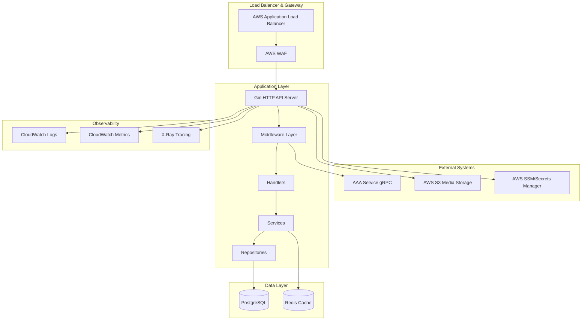

# Design Document

## Overview

This design document outlines the architecture and implementation strategy for transforming the Marketplace Catalogs microservice into a production-ready system. The service will handle four catalog types (Products, Services, Labour, Contracts) with enterprise-grade security, performance, observability, and operational excellence.

The design follows clean architecture principles with clear separation of concerns, leveraging Go 1.22+, Gin HTTP framework, GORM v2 with PostgreSQL, Redis caching, and integration with external AAA service via gRPC client.

## Architecture

### High-Level Architecture



### Service Architecture Layers

1. **HTTP Layer**: Gin router with middleware for auth, validation, logging, metrics
2. **Handler Layer**: HTTP request/response handling with OpenAPI documentation
3. **Service Layer**: Business logic, orchestration, and external service integration
4. **Repository Layer**: Data access abstraction with GORM
5. **Infrastructure Layer**: Database, cache, external clients, configuration

### Multi-Tenancy Design

All data access will be tenant-aware with automatic tenant_id filtering:

- JWT claims extraction for tenant identification
- Repository-level tenant enforcement
- Redis cache namespacing by tenant
- Audit logging with tenant context

## Components and Interfaces

### Core Domain Models

```go
// Base model with tenant isolation
type BaseModel struct {
    ID        string    `gorm:"primaryKey;type:char(26)" json:"id"`
    TenantID  string    `gorm:"index:idx_tenant;not null" json:"tenant_id"`
    CreatedAt time.Time `json:"created_at"`
    UpdatedAt time.Time `json:"updated_at"`
    DeletedAt gorm.DeletedAt `gorm:"index" json:"-"`
    CreatedBy string    `json:"created_by"`
    UpdatedBy string    `json:"updated_by"`
    Version   int64     `gorm:"default:1" json:"version"`
}

// Catalog represents the main catalog entity
type Catalog struct {
    BaseModel
    Type         CatalogType `gorm:"index:idx_tenant_type;not null" json:"type"`
    Name         string      `gorm:"index:idx_search;not null" json:"name"`
    Description  string      `gorm:"index:idx_search" json:"description"`
    CategoryID   string      `gorm:"index" json:"category_id"`
    VendorID     string      `gorm:"index" json:"vendor_id"`
    Status       Status      `gorm:"index:idx_tenant_status;default:'draft'" json:"status"`
    Attributes   JSONB       `gorm:"type:jsonb" json:"attributes"`
    Tags         pq.StringArray `gorm:"type:text[]" json:"tags"`

    // Relationships
    Category *Category `json:"category,omitempty"`
    Variants []Variant `json:"variants,omitempty"`
    Media    []Media   `json:"media,omitempty"`
    Pricing  []Price   `json:"pricing,omitempty"`
}

type CatalogType string
const (
    TypeProduct  CatalogType = "product"
    TypeService  CatalogType = "service"
    TypeLabour   CatalogType = "labour"
    TypeContract CatalogType = "contract"
)
```

### Repository Interfaces

```go
type CatalogRepository interface {
    Create(ctx context.Context, catalog *Catalog) error
    GetByID(ctx context.Context, tenantID, id string) (*Catalog, error)
    List(ctx context.Context, tenantID string, filter CatalogFilter) (*PaginatedResult[Catalog], error)
    Update(ctx context.Context, catalog *Catalog) error
    Delete(ctx context.Context, tenantID, id string) error
    Search(ctx context.Context, tenantID string, query SearchQuery) (*PaginatedResult[Catalog], error)
    BulkUpsert(ctx context.Context, catalogs []Catalog) error
}

type CatalogFilter struct {
    Type       []CatalogType
    CategoryID []string
    VendorID   []string
    Status     []Status
    Tags       []string
    PriceRange *PriceRange
    Pagination PaginationRequest
    Sort       SortOptions
}
```

### Service Interfaces

```go
type CatalogService interface {
    CreateCatalog(ctx context.Context, req CreateCatalogRequest) (*Catalog, error)
    GetCatalog(ctx context.Context, tenantID, id string) (*Catalog, error)
    ListCatalogs(ctx context.Context, tenantID string, filter CatalogFilter) (*PaginatedResult[Catalog], error)
    UpdateCatalog(ctx context.Context, req UpdateCatalogRequest) (*Catalog, error)
    DeleteCatalog(ctx context.Context, tenantID, id string) error
    PublishCatalog(ctx context.Context, tenantID, id string) error
    UnpublishCatalog(ctx context.Context, tenantID, id string) error
    SearchCatalogs(ctx context.Context, tenantID string, query SearchQuery) (*PaginatedResult[Catalog], error)
    BulkUpsertCatalogs(ctx context.Context, req BulkUpsertRequest) (*BulkUpsertResponse, error)
}
```

### AAA Integration

```go
type AAAClient interface {
    ValidateToken(ctx context.Context, token string) (*TokenClaims, error)
    Authorize(ctx context.Context, req AuthorizeRequest) (*AuthorizeResponse, error)
}

type AuthorizeRequest struct {
    UserID     string
    TenantID   string
    Resource   string // "catalog"
    Action     string // "read", "create", "update", "delete", "publish"
    ResourceID string // specific catalog ID for resource-level permissions
}
```

## Data Models

### Database Schema Design

#### Core Tables

1. **catalogs** - Main catalog entities
2. **categories** - Hierarchical category structure
3. **variants** - Product/service variants
4. **media** - Associated media files
5. **pricing** - Pricing information with history
6. **availability** - Availability and inventory data
7. **vendors** - Vendor/FPO information
8. **audit_logs** - Append-only audit trail
9. **schema_migrations** - Custom migration tracking

#### Indexing Strategy

```sql
-- Composite indexes for common query patterns
CREATE INDEX idx_catalogs_tenant_type_status_updated ON catalogs(tenant_id, type, status, updated_at DESC);
CREATE INDEX idx_catalogs_tenant_category ON catalogs(tenant_id, category_id);
CREATE INDEX idx_catalogs_tenant_vendor ON catalogs(tenant_id, vendor_id);

-- Full-text search indexes
CREATE INDEX idx_catalogs_search_name ON catalogs USING gin(to_tsvector('english', name));
CREATE INDEX idx_catalogs_search_desc ON catalogs USING gin(to_tsvector('english', description));

-- JSONB attribute indexes
CREATE INDEX idx_catalogs_attributes ON catalogs USING gin(attributes);

-- Array indexes for tags
CREATE INDEX idx_catalogs_tags ON catalogs USING gin(tags);
```

### Type-Specific Attribute Schemas

```go
// Product attributes
type ProductAttributes struct {
    SKU         string   `json:"sku" validate:"required"`
    Brand       string   `json:"brand"`
    Weight      *float64 `json:"weight"`
    Dimensions  *Dimensions `json:"dimensions"`
    Variants    []ProductVariant `json:"variants"`
}

// Service attributes
type ServiceAttributes struct {
    Duration    string   `json:"duration" validate:"required"`
    SLA         SLA      `json:"sla"`
    Location    string   `json:"location"`
    Skills      []string `json:"skills"`
}

// Labour attributes
type LabourAttributes struct {
    Skills      []string `json:"skills" validate:"required"`
    Experience  int      `json:"experience"`
    UnitRate    Money    `json:"unit_rate" validate:"required"`
    RateType    string   `json:"rate_type" validate:"oneof=hourly daily weekly monthly"`
    Availability []TimeSlot `json:"availability"`
}

// Contract attributes
type ContractAttributes struct {
    Term        string   `json:"term" validate:"required"`
    Duration    int      `json:"duration" validate:"required"`
    StartDate   time.Time `json:"start_date"`
    EndDate     time.Time `json:"end_date"`
    Terms       string   `json:"terms"`
}
```

## Error Handling

### Structured Error Model

```go
type APIError struct {
    Code      string                 `json:"code"`
    Message   string                 `json:"message"`
    Details   map[string]interface{} `json:"details,omitempty"`
    RequestID string                 `json:"request_id"`
    Timestamp time.Time              `json:"timestamp"`
}

// Error codes following domain-specific patterns
const (
    ErrCodeValidation     = "VALIDATION_ERROR"
    ErrCodeNotFound       = "CATALOG_NOT_FOUND"
    ErrCodeUnauthorized   = "UNAUTHORIZED_ACCESS"
    ErrCodeConflict       = "CATALOG_CONFLICT"
    ErrCodeRateLimit      = "RATE_LIMIT_EXCEEDED"
    ErrCodeInternal       = "INTERNAL_ERROR"
)
```

### Error Handling Strategy

1. **Validation Errors**: Return 400 with detailed field-level validation messages
2. **Authorization Errors**: Return 401/403 with minimal information to prevent information leakage
3. **Business Logic Errors**: Return 409 with domain-specific error codes
4. **System Errors**: Return 500 with generic message, log detailed error internally
5. **Rate Limiting**: Return 429 with retry-after headers

## Testing Strategy

### Unit Testing

- **Coverage Target**: ≥85% for critical packages
- **Test Structure**: Mirror source code structure in `tests/` directory
- **Mocking**: Use interfaces for external dependencies (AAA, Redis, DB)
- **Test Data**: Centralized test fixtures in `tests/data/`

### Integration Testing

- **Environment**: Docker Compose with PostgreSQL, Redis
- **Scope**: Repository layer, service layer with real dependencies
- **Data**: Isolated test databases with cleanup between tests
- **Assertions**: Golden file comparisons for API responses

### Contract Testing

- **OpenAPI**: Automated breaking change detection with oasdiff
- **AAA Client**: Mock gRPC server for testing authorization flows
- **Database**: Schema migration testing with rollback scenarios

### Load Testing

- **Tool**: k6 with realistic data sets
- **Scenarios**: CRUD operations, search queries, bulk operations
- **Targets**: P95 ≤ 120ms, cache hit ratio ≥70%
- **Monitoring**: Real-time metrics during load tests

## Performance Considerations

### Caching Strategy

```go
type CacheManager interface {
    Get(ctx context.Context, key string, dest interface{}) error
    Set(ctx context.Context, key string, value interface{}, ttl time.Duration) error
    Delete(ctx context.Context, key string) error
    InvalidatePattern(ctx context.Context, pattern string) error
}

// Cache key patterns
const (
    CatalogDetailKey = "tenant:%s:catalog:%s"
    CatalogListKey   = "tenant:%s:catalogs:filter:%s"
    CategoryTreeKey  = "tenant:%s:categories"
)
```

### Query Optimization

1. **Selective Loading**: Use GORM Select() to load only required fields
2. **Preloading**: Strategic use of Preload() to prevent N+1 queries
3. **Pagination**: Cursor-based pagination for large datasets
4. **Filtering**: Database-level filtering before application processing

### Connection Management

- **Connection Pooling**: Optimized PostgreSQL connection pool settings
- **Read Replicas**: Separate read/write connections for scaling
- **Circuit Breakers**: Resilience patterns for external service calls
- **Timeouts**: Appropriate context timeouts for all operations

## Security Architecture

### Authentication Flow

1. **JWT Validation**: Local JWT signature verification
2. **AAA Authorization**: gRPC call to AAA service for resource permissions
3. **Tenant Extraction**: Extract tenant_id from JWT claims
4. **Permission Caching**: Short-lived cache for authorization decisions

### Data Protection

- **Encryption at Rest**: PostgreSQL TDE, Redis AUTH
- **Encryption in Transit**: TLS 1.3 for all communications
- **Secrets Management**: AWS Secrets Manager integration
- **PII Handling**: Documented data classification and retention policies

### Rate Limiting

```go
type RateLimiter interface {
    Allow(ctx context.Context, key string, limit int, window time.Duration) (bool, error)
    GetRemaining(ctx context.Context, key string) (int, error)
}

// Rate limiting strategies
const (
    GlobalRateLimit  = 1000 // requests per minute globally
    TenantRateLimit  = 100  // requests per minute per tenant
    UserRateLimit    = 50   // requests per minute per user
)
```

## Deployment Architecture

### Container Strategy

- **Base Image**: Distroless for minimal attack surface
- **Multi-stage Build**: Separate build and runtime stages
- **Non-root User**: Security-hardened container execution
- **Health Checks**: Proper liveness and readiness probes

### Infrastructure Components

1. **ECS Fargate**: Serverless container execution
2. **Application Load Balancer**: HTTP/HTTPS termination and routing
3. **Auto Scaling**: CPU and memory-based scaling policies
4. **Service Discovery**: ECS service discovery for internal communication

### Blue/Green Deployment

1. **Traffic Shifting**: Gradual traffic migration between environments
2. **Health Validation**: Automated health checks before traffic switch
3. **Rollback Capability**: Immediate rollback on failure detection
4. **Database Migrations**: Safe AutoMigrate execution with feature flags

## Observability Design

### Logging Strategy

```go
type Logger interface {
    Info(ctx context.Context, msg string, fields ...Field)
    Error(ctx context.Context, msg string, err error, fields ...Field)
    Debug(ctx context.Context, msg string, fields ...Field)
}

// Standard log fields
type LogFields struct {
    RequestID string
    TenantID  string
    UserID    string
    Operation string
    Duration  time.Duration
}
```

### Metrics Collection

- **RED Metrics**: Rate, Errors, Duration for all endpoints
- **USE Metrics**: Utilization, Saturation, Errors for resources
- **Business Metrics**: Catalog creation rate, search queries, cache performance
- **Custom Metrics**: Domain-specific KPIs and SLOs

### Distributed Tracing

- **Trace Propagation**: OpenTelemetry context propagation
- **Span Attributes**: Rich metadata for debugging
- **Sampling Strategy**: 1% baseline, 100% on errors
- **Integration Points**: HTTP → Service → Repository → Database → Cache

This design provides a comprehensive foundation for building a production-ready marketplace catalogs service with enterprise-grade capabilities.
