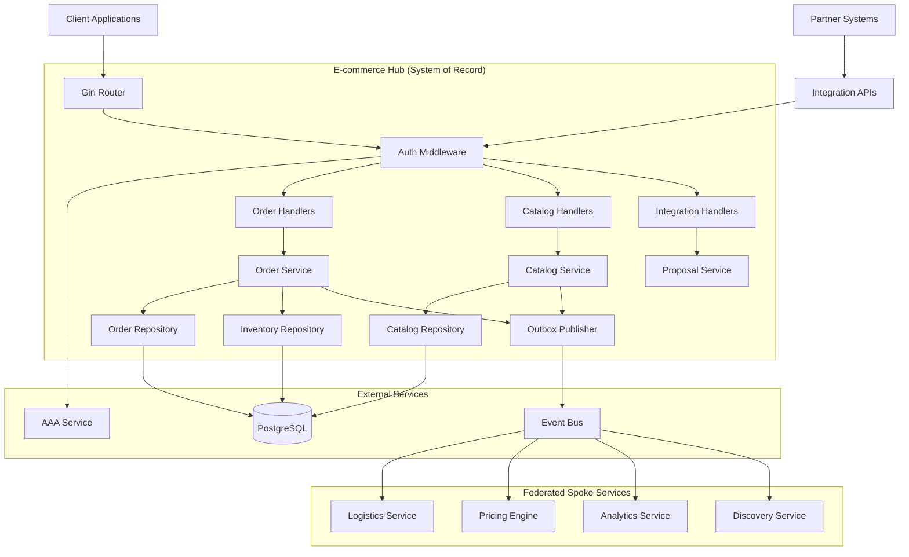
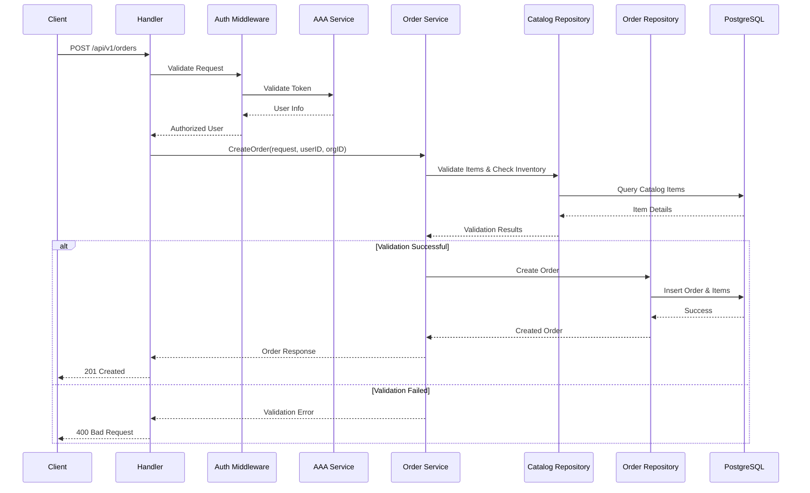
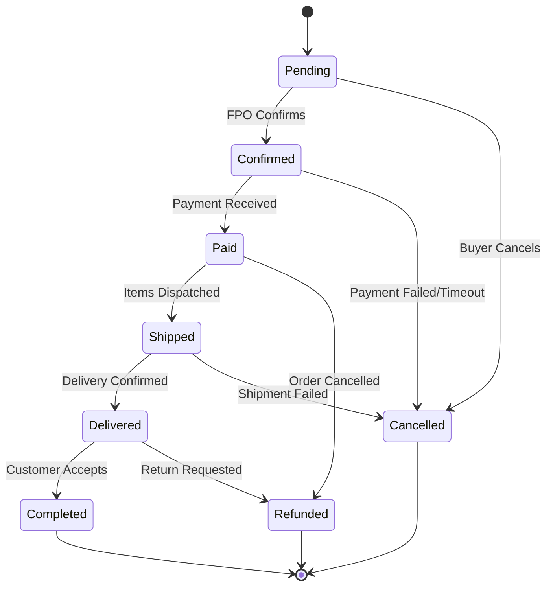

# Order Management System - Design Document

## Overview

The Order Management System serves as the **system of record** for FPO-level ERP catalog data and provides HTTP REST APIs for managing the complete order lifecycle in the KisanLink E-commerce Service. As the authoritative hub in a federated network, it masters all catalog entities (Products, Services, Labour), inventory management, and order processing. Built with Gin framework following layered architecture (main → routes → handlers → services → repositories), it integrates with aaa-service for authentication/authorization and kisanlink-db for PostgreSQL persistence. The system publishes events via outbox pattern for eventual consistency across the federated network and enforces deny-by-default permissions with org-scoped multi-tenancy.

## Architecture

### System Architecture Diagram (Hub & Spoke Federation)



### Layered Architecture

1. **Routes Layer** (`internal/routes/`)
   - Route definitions and middleware setup
   - Request routing and parameter binding
   - Swagger documentation integration

2. **Handlers Layer** (`internal/handlers/orders/`)
   - HTTP request/response handling
   - Input validation and sanitization
   - Response formatting and error handling

3. **Services Layer** (`internal/services/orders/`)
   - Business logic implementation
   - Transaction orchestration
   - Integration with external services

4. **Repository Layer** (`internal/repositories/orders/`)
   - Data access abstraction
   - PostgreSQL query implementation
   - kisanlink-db model integration

## Components and Interfaces

### Core Components

#### 1. Order Handler

```go
type OrderHandler interface {
    CreateOrder(c *gin.Context)
    GetOrder(c *gin.Context)
    ListOrders(c *gin.Context)
    UpdateOrderStatus(c *gin.Context)
    DeleteOrder(c *gin.Context)
}
```

#### 2. Order Service

```go
type OrderService interface {
    CreateOrder(ctx context.Context, req CreateOrderRequest, userID string, orgID string) (*Order, error)
    GetOrderByID(ctx context.Context, orderID string, userID string, orgID string) (*Order, error)
    ListOrders(ctx context.Context, filters OrderFilters, userID string, orgID string) (*OrderListResponse, error)
    UpdateOrderStatus(ctx context.Context, orderID string, status OrderStatus, userID string, orgID string) (*Order, error)
    ValidateOrderPermissions(ctx context.Context, orderID string, userID string, orgID string, action string) error
}
```

#### 3. Order Repository

```go
type OrderRepository interface {
    Create(ctx context.Context, order *Order) error
    GetByID(ctx context.Context, id string) (*Order, error)
    List(ctx context.Context, filters OrderFilters) ([]*Order, int64, error)
    Update(ctx context.Context, order *Order) error
    Delete(ctx context.Context, id string) error
    GetByOrganization(ctx context.Context, orgID string, filters OrderFilters) ([]*Order, int64, error)
}
```

### API Endpoints (Authoritative System of Record)

#### Catalog Management (Authoritative Writes)

| Method | Endpoint                      | Description                         | Auth Required | Idempotent | Validation Rules                                 |
| ------ | ----------------------------- | ----------------------------------- | ------------- | ---------- | ------------------------------------------------ |
| POST   | `/api/v1/catalog/products`    | Create product (org-scoped)         | Yes           | Yes        | Collaborator role, org ownership, product schema |
| POST   | `/api/v1/catalog/services`    | Create service (org-scoped)         | Yes           | Yes        | Collaborator role, org ownership, service schema |
| POST   | `/api/v1/catalog/labour`      | Create labour offering (org-scoped) | Yes           | Yes        | Collaborator role, org ownership, labour schema  |
| PUT    | `/api/v1/catalog/{type}/{id}` | Update catalog item                 | Yes           | Yes        | Collaborator role, org ownership, item exists    |
| GET    | `/api/v1/catalog`             | List catalog with filters           | Yes           | No         | Org-scoped visibility, pagination                |
| GET    | `/api/v1/catalog/{type}/{id}` | Get catalog item by ID              | Yes           | No         | Org-scoped visibility                            |

**Catalog Schema Validation:**

- **Products**: name (required), description, price (required), quantity (required), unit (required)
- **Services**: name (required), description, rate (required), duration (required)
- **Labour**: skill_type (required), hourly_rate (required), availability (required)
- **Common**: All inherit from kisanlink-db base models with audit trail and organization association

#### Inventory Management (Authoritative for Products)

| Method | Endpoint                      | Description                      | Auth Required | Idempotent |
| ------ | ----------------------------- | -------------------------------- | ------------- | ---------- |
| POST   | `/api/v1/inventory/lots`      | Create inventory lot             | Yes           | Yes        |
| PATCH  | `/api/v1/inventory/lots/{id}` | Adjust/reserve/release inventory | Yes           | Yes        |
| GET    | `/api/v1/inventory/lots`      | List inventory lots              | Yes           | No         |

#### Order Management (Authoritative Writes)

| Method | Endpoint                     | Description              | Auth Required | Idempotent |
| ------ | ---------------------------- | ------------------------ | ------------- | ---------- |
| POST   | `/api/v1/orders`             | Create new order         | Yes           | Yes        |
| GET    | `/api/v1/orders/{id}`        | Get order by ID          | Yes           | No         |
| GET    | `/api/v1/orders`             | List orders with filters | Yes           | No         |
| PATCH  | `/api/v1/orders/{id}/status` | Update order status      | Yes           | Yes        |
| DELETE | `/api/v1/orders/{id}`        | Cancel/delete order      | Yes           | Yes        |

#### Integration Hooks (Federated Network)

| Method | Endpoint                                       | Description                  | Auth Required | Idempotent |
| ------ | ---------------------------------------------- | ---------------------------- | ------------- | ---------- |
| POST   | `/api/v1/integrations/catalog/proposals`       | Submit catalog proposals     | Yes           | Yes        |
| POST   | `/api/v1/integrations/orders/acknowledgements` | Acknowledge order intake     | Yes           | Yes        |
| GET    | `/api/v1/integrations/catalog/exports`         | Delta export since watermark | Yes           | No         |

#### Request/Response Examples

**Create Order Request (Mixed Catalog Types):**

```json
{
  "buyer_organization_id": "org_123",
  "seller_organization_id": "org_456",
  "items": [
    {
      "catalog_item_id": "prod_789",
      "catalog_item_type": "product",
      "quantity": 10,
      "unit_price": 25.5
    },
    {
      "catalog_item_id": "serv_456",
      "catalog_item_type": "service",
      "quantity": 2,
      "unit_price": 150.0
    },
    {
      "catalog_item_id": "lab_123",
      "catalog_item_type": "labour",
      "quantity": 8,
      "unit_price": 75.0
    }
  ],
  "shipping_address": {
    "street": "123 Farm Road",
    "city": "Rural City",
    "state": "State",
    "postal_code": "12345",
    "country": "India"
  },
  "notes": "Mixed order: products, services, and labour"
}
```

**Order Response:**

```json
{
  "success": true,
  "data": {
    "id": "order_abc123",
    "order_number": "ORD-2024-001",
    "status": "pending",
    "buyer_organization_id": "org_123",
    "seller_organization_id": "org_456",
    "total_amount": 255.00,
    "tax_amount": 25.50,
    "items": [...],
    "shipping_address": {...},
    "created_at": "2024-01-15T10:30:00Z",
    "updated_at": "2024-01-15T10:30:00Z"
  }
}
```

## Data Models

### PostgreSQL Schema Design

#### Orders Table

```sql
CREATE TABLE orders (
    id UUID PRIMARY KEY DEFAULT gen_random_uuid(),
    order_number VARCHAR(50) UNIQUE NOT NULL,
    status VARCHAR(20) NOT NULL DEFAULT 'pending',
    buyer_organization_id UUID NOT NULL,
    seller_organization_id UUID NOT NULL,
    buyer_user_id UUID NOT NULL,

    -- Financial Information
    subtotal_amount DECIMAL(12,2) NOT NULL DEFAULT 0.00,
    tax_amount DECIMAL(12,2) NOT NULL DEFAULT 0.00,
    discount_amount DECIMAL(12,2) NOT NULL DEFAULT 0.00,
    shipping_amount DECIMAL(12,2) NOT NULL DEFAULT 0.00,
    total_amount DECIMAL(12,2) NOT NULL DEFAULT 0.00,

    -- Shipping Information
    shipping_address JSONB,
    estimated_delivery_date TIMESTAMP,
    actual_delivery_date TIMESTAMP,

    -- Metadata
    notes TEXT,
    metadata JSONB,

    -- Audit Fields (kisanlink-db base model)
    created_at TIMESTAMP NOT NULL DEFAULT NOW(),
    updated_at TIMESTAMP NOT NULL DEFAULT NOW(),
    created_by UUID,
    updated_by UUID,
    deleted_at TIMESTAMP,
    version INTEGER NOT NULL DEFAULT 1,

    -- Constraints
    CONSTRAINT orders_status_check CHECK (status IN ('pending', 'confirmed', 'paid', 'shipped', 'delivered', 'completed', 'cancelled', 'refunded')),
    CONSTRAINT orders_amounts_check CHECK (
        subtotal_amount >= 0 AND
        tax_amount >= 0 AND
        discount_amount >= 0 AND
        shipping_amount >= 0 AND
        total_amount >= 0
    )
);

-- Indexes
CREATE INDEX idx_orders_buyer_org ON orders(buyer_organization_id) WHERE deleted_at IS NULL;
CREATE INDEX idx_orders_seller_org ON orders(seller_organization_id) WHERE deleted_at IS NULL;
CREATE INDEX idx_orders_status ON orders(status) WHERE deleted_at IS NULL;
CREATE INDEX idx_orders_created_at ON orders(created_at) WHERE deleted_at IS NULL;
CREATE INDEX idx_orders_order_number ON orders(order_number) WHERE deleted_at IS NULL;
```

#### Order Items Table

```sql
CREATE TABLE order_items (
    id UUID PRIMARY KEY DEFAULT gen_random_uuid(),
    order_id UUID NOT NULL REFERENCES orders(id) ON DELETE CASCADE,

    -- Catalog Reference
    catalog_item_id UUID NOT NULL,
    catalog_item_type VARCHAR(20) NOT NULL, -- 'product', 'service', 'labour'
    catalog_item_name VARCHAR(255) NOT NULL,
    catalog_item_sku VARCHAR(100),

    -- Quantity and Pricing
    quantity DECIMAL(10,3) NOT NULL,
    unit_price DECIMAL(10,2) NOT NULL,
    total_price DECIMAL(12,2) NOT NULL,

    -- Tax and Discounts
    tax_rate DECIMAL(5,4) DEFAULT 0.0000,
    tax_amount DECIMAL(10,2) DEFAULT 0.00,
    discount_rate DECIMAL(5,4) DEFAULT 0.0000,
    discount_amount DECIMAL(10,2) DEFAULT 0.00,

    -- Metadata
    metadata JSONB,

    -- Audit Fields
    created_at TIMESTAMP NOT NULL DEFAULT NOW(),
    updated_at TIMESTAMP NOT NULL DEFAULT NOW(),
    created_by UUID,
    updated_by UUID,
    deleted_at TIMESTAMP,

    -- Constraints
    CONSTRAINT order_items_catalog_type_check CHECK (catalog_item_type IN ('product', 'service', 'labour')),
    CONSTRAINT order_items_quantity_check CHECK (quantity > 0),
    CONSTRAINT order_items_price_check CHECK (unit_price >= 0 AND total_price >= 0)
);

-- Indexes
CREATE INDEX idx_order_items_order_id ON order_items(order_id) WHERE deleted_at IS NULL;
CREATE INDEX idx_order_items_catalog ON order_items(catalog_item_id, catalog_item_type) WHERE deleted_at IS NULL;
```

#### Order Status History Table

```sql
CREATE TABLE order_status_history (
    id UUID PRIMARY KEY DEFAULT gen_random_uuid(),
    order_id UUID NOT NULL REFERENCES orders(id) ON DELETE CASCADE,

    -- Status Information
    from_status VARCHAR(20),
    to_status VARCHAR(20) NOT NULL,
    reason VARCHAR(500),

    -- User Information
    changed_by_user_id UUID NOT NULL,
    changed_by_organization_id UUID,

    -- Metadata
    metadata JSONB,

    -- Audit Fields
    created_at TIMESTAMP NOT NULL DEFAULT NOW(),

    -- Constraints
    CONSTRAINT order_status_history_status_check CHECK (
        from_status IN ('pending', 'confirmed', 'paid', 'shipped', 'delivered', 'completed', 'cancelled', 'refunded') AND
        to_status IN ('pending', 'confirmed', 'paid', 'shipped', 'delivered', 'completed', 'cancelled', 'refunded')
    )
);

-- Indexes
CREATE INDEX idx_order_status_history_order_id ON order_status_history(order_id);
CREATE INDEX idx_order_status_history_created_at ON order_status_history(created_at);
```

#### Outbox Table (Event Publishing)

```sql
CREATE TABLE outbox_events (
    id UUID PRIMARY KEY DEFAULT gen_random_uuid(),

    -- Event Identification
    event_type VARCHAR(100) NOT NULL, -- e.g., 'OrderCreated', 'CatalogItemUpdated'
    event_version VARCHAR(10) NOT NULL DEFAULT 'v1',
    aggregate_type VARCHAR(50) NOT NULL, -- 'order', 'catalog_item', 'inventory_lot'
    aggregate_id UUID NOT NULL,

    -- Event Content
    event_data JSONB NOT NULL,
    event_metadata JSONB,

    -- Deduplication
    idempotency_key VARCHAR(255) UNIQUE,

    -- Publishing Status
    published_at TIMESTAMP,
    failed_attempts INTEGER DEFAULT 0,
    last_error TEXT,

    -- Audit Fields
    created_at TIMESTAMP NOT NULL DEFAULT NOW(),

    -- Constraints
    CONSTRAINT outbox_events_version_check CHECK (event_version ~ '^v\d+$'),
    CONSTRAINT outbox_events_attempts_check CHECK (failed_attempts >= 0)
);

-- Indexes for efficient publishing
CREATE INDEX idx_outbox_events_unpublished ON outbox_events(created_at) WHERE published_at IS NULL;
CREATE INDEX idx_outbox_events_aggregate ON outbox_events(aggregate_type, aggregate_id);
CREATE INDEX idx_outbox_events_type ON outbox_events(event_type, event_version);
```

#### Catalog Items Table (System of Record)

```sql
CREATE TABLE catalog_items (
    id UUID PRIMARY KEY DEFAULT gen_random_uuid(),

    -- Global Stable ID (kisanlink-db/core/hash)
    global_id VARCHAR(100) UNIQUE NOT NULL,

    -- Organization Scoping
    organization_id UUID NOT NULL,

    -- Item Classification
    item_type VARCHAR(20) NOT NULL, -- 'PRODUCT', 'SERVICE', 'LABOUR'
    category VARCHAR(100),
    subcategory VARCHAR(100),

    -- Basic Information
    name VARCHAR(255) NOT NULL,
    description TEXT,
    sku VARCHAR(100),
    unit_of_measure VARCHAR(50),

    -- Pricing (Authoritative)
    base_price DECIMAL(12,2) NOT NULL,
    currency VARCHAR(3) DEFAULT 'INR',

    -- Availability & Visibility
    is_active BOOLEAN DEFAULT true,
    visibility VARCHAR(20) DEFAULT 'PRIVATE', -- 'PRIVATE', 'ORG', 'NETWORK', 'PUBLIC'

    -- Product-specific fields
    weight DECIMAL(10,3),
    dimensions JSONB, -- {length, width, height}
    perishable BOOLEAN DEFAULT false,
    shelf_life_days INTEGER,

    -- Service-specific fields
    duration_minutes INTEGER,
    service_area JSONB, -- geographic coverage

    -- Labour-specific fields
    skill_level VARCHAR(50),
    hourly_rate DECIMAL(10,2),

    -- Metadata
    tags TEXT[],
    attributes JSONB,
    images TEXT[],

    -- Audit Fields (kisanlink-db base model)
    created_at TIMESTAMP NOT NULL DEFAULT NOW(),
    updated_at TIMESTAMP NOT NULL DEFAULT NOW(),
    created_by UUID,
    updated_by UUID,
    deleted_at TIMESTAMP,
    version INTEGER NOT NULL DEFAULT 1,

    -- Constraints
    CONSTRAINT catalog_items_type_check CHECK (item_type IN ('PRODUCT', 'SERVICE', 'LABOUR')),
    CONSTRAINT catalog_items_visibility_check CHECK (visibility IN ('PRIVATE', 'ORG', 'NETWORK', 'PUBLIC')),
    CONSTRAINT catalog_items_price_check CHECK (base_price >= 0)
);

-- Indexes
CREATE INDEX idx_catalog_items_org ON catalog_items(organization_id) WHERE deleted_at IS NULL;
CREATE INDEX idx_catalog_items_type ON catalog_items(item_type) WHERE deleted_at IS NULL;
CREATE INDEX idx_catalog_items_visibility ON catalog_items(visibility) WHERE deleted_at IS NULL;
CREATE INDEX idx_catalog_items_active ON catalog_items(is_active) WHERE deleted_at IS NULL;
CREATE INDEX idx_catalog_items_global_id ON catalog_items(global_id) WHERE deleted_at IS NULL;
```

#### Inventory Lots Table (Product Inventory Authority)

```sql
CREATE TABLE inventory_lots (
    id UUID PRIMARY KEY DEFAULT gen_random_uuid(),

    -- Product Reference
    catalog_item_id UUID NOT NULL REFERENCES catalog_items(id),
    organization_id UUID NOT NULL,

    -- Lot Information
    lot_number VARCHAR(100) NOT NULL,
    batch_number VARCHAR(100),

    -- Quantity Management
    initial_quantity DECIMAL(12,3) NOT NULL,
    available_quantity DECIMAL(12,3) NOT NULL,
    reserved_quantity DECIMAL(12,3) DEFAULT 0,
    sold_quantity DECIMAL(12,3) DEFAULT 0,

    -- Quality & Compliance
    quality_grade VARCHAR(50),
    harvest_date DATE,
    expiry_date DATE,

    -- Location
    warehouse_location VARCHAR(255),
    storage_conditions JSONB,

    -- Pricing Override
    lot_price DECIMAL(12,2), -- Override catalog base price

    -- Status
    status VARCHAR(20) DEFAULT 'available', -- 'available', 'reserved', 'sold', 'expired', 'damaged'

    -- Metadata
    metadata JSONB,

    -- Audit Fields
    created_at TIMESTAMP NOT NULL DEFAULT NOW(),
    updated_at TIMESTAMP NOT NULL DEFAULT NOW(),
    created_by UUID,
    updated_by UUID,
    deleted_at TIMESTAMP,

    -- Constraints
    CONSTRAINT inventory_lots_quantities_check CHECK (
        initial_quantity >= 0 AND
        available_quantity >= 0 AND
        reserved_quantity >= 0 AND
        sold_quantity >= 0 AND
        available_quantity + reserved_quantity + sold_quantity <= initial_quantity
    ),
    CONSTRAINT inventory_lots_status_check CHECK (status IN ('available', 'reserved', 'sold', 'expired', 'damaged')),
    CONSTRAINT inventory_lots_lot_number_org_unique UNIQUE (lot_number, organization_id)
);

-- Indexes
CREATE INDEX idx_inventory_lots_catalog_item ON inventory_lots(catalog_item_id) WHERE deleted_at IS NULL;
CREATE INDEX idx_inventory_lots_org ON inventory_lots(organization_id) WHERE deleted_at IS NULL;
CREATE INDEX idx_inventory_lots_status ON inventory_lots(status) WHERE deleted_at IS NULL;
CREATE INDEX idx_inventory_lots_available ON inventory_lots(available_quantity) WHERE deleted_at IS NULL AND status = 'available';
```

### DynamoDB Collections (High-Volume, Simple Operations)

#### Order Tracking Events (DynamoDB)

```json
// Table: order-tracking-events
// Partition Key: order_id
// Sort Key: timestamp
{
  "order_id": "order_abc123",
  "timestamp": "2024-01-15T10:30:00.123Z",
  "event_type": "status_change",
  "event_data": {
    "from_status": "pending",
    "to_status": "confirmed",
    "changed_by": "user_456",
    "reason": "Payment confirmed"
  },
  "ttl": 1735689000, // Auto-expire after 1 year
  "created_at": "2024-01-15T10:30:00.123Z"
}
```

#### User Activity Sessions (DynamoDB)

```json
// Table: user-activity-sessions
// Partition Key: user_id
// Sort Key: session_start
{
  "user_id": "user_123",
  "session_start": "2024-01-15T09:00:00Z",
  "session_id": "sess_xyz789",
  "organization_id": "org_456",
  "last_activity": "2024-01-15T10:30:00Z",
  "actions": [
    {
      "timestamp": "2024-01-15T10:15:00Z",
      "action": "view_order",
      "resource_id": "order_abc123"
    },
    {
      "timestamp": "2024-01-15T10:30:00Z",
      "action": "update_order_status",
      "resource_id": "order_abc123"
    }
  ],
  "ttl": 1704110400, // Auto-expire after 30 days
  "ip_address": "192.168.1.100",
  "user_agent": "Mozilla/5.0..."
}
```

#### API Rate Limiting (DynamoDB)

```json
// Table: api-rate-limits
// Partition Key: rate_limit_key (user_id:endpoint or org_id:endpoint)
// Sort Key: window_start
{
  "rate_limit_key": "user_123:/api/v1/orders",
  "window_start": "2024-01-15T10:00:00Z",
  "request_count": 45,
  "window_duration_seconds": 3600,
  "limit": 100,
  "first_request": "2024-01-15T10:05:23Z",
  "last_request": "2024-01-15T10:58:12Z",
  "ttl": 1704110400 // Auto-expire after window + buffer
}
```

#### Event Stream Processing (DynamoDB)

```json
// Table: event-processing-checkpoints
// Partition Key: consumer_group
// Sort Key: partition_id
{
  "consumer_group": "order-analytics-processor",
  "partition_id": "partition_0",
  "last_processed_offset": 12345,
  "last_processed_timestamp": "2024-01-15T10:30:00Z",
  "consumer_instance_id": "analytics-worker-01",
  "processing_lag_ms": 150,
  "updated_at": "2024-01-15T10:30:05Z"
}
```

#### Cache Invalidation Tracking (DynamoDB)

```json
// Table: cache-invalidation-log
// Partition Key: cache_key
// Sort Key: invalidation_timestamp
{
  "cache_key": "catalog:org_456:products",
  "invalidation_timestamp": "2024-01-15T10:30:00Z",
  "invalidation_reason": "catalog_item_updated",
  "affected_resource_id": "prod_789",
  "invalidated_by": "user_123",
  "cache_regions": ["us-east-1", "ap-south-1"],
  "ttl": 1704196800 // Auto-expire after 7 days
}
```

#### Search Query Analytics (DynamoDB)

```json
// Table: search-query-analytics
// Partition Key: date_partition (YYYY-MM-DD)
// Sort Key: query_timestamp
{
  "date_partition": "2024-01-15",
  "query_timestamp": "2024-01-15T10:30:00.123Z",
  "user_id": "user_123",
  "organization_id": "org_456",
  "query_text": "organic tomatoes",
  "filters": {
    "category": "vegetables",
    "price_range": "10-50",
    "location": "maharashtra"
  },
  "results_count": 25,
  "clicked_results": ["prod_101", "prod_205"],
  "response_time_ms": 85,
  "ttl": 1735689000 // Auto-expire after 1 year
}
```

#### Notification Delivery Status (DynamoDB)

```json
// Table: notification-delivery-status
// Partition Key: notification_id
// Sort Key: delivery_attempt
{
  "notification_id": "notif_abc123",
  "delivery_attempt": 1,
  "recipient_type": "user", // user, organization, webhook
  "recipient_id": "user_456",
  "notification_type": "order_status_update",
  "delivery_channel": "email", // email, sms, push, webhook
  "status": "delivered", // pending, delivered, failed, bounced
  "attempted_at": "2024-01-15T10:30:00Z",
  "delivered_at": "2024-01-15T10:30:02Z",
  "error_message": null,
  "retry_count": 0,
  "ttl": 1735689000 // Auto-expire after 1 year
}
```

### Data Storage Strategy

#### PostgreSQL (ACID Transactions, Complex Queries)

- **Orders & Order Items**: Complex relationships, financial calculations
- **Catalog Items**: Rich metadata, complex filtering
- **Inventory Lots**: Quantity management with constraints
- **User Organizations**: Relational data with foreign keys
- **Outbox Events**: Transactional event publishing

#### DynamoDB (High Volume, Simple Operations)

- **Order Tracking Events**: High-frequency status updates
- **User Activity Sessions**: Session management and audit trails
- **API Rate Limiting**: Fast read/write for rate limit checks
- **Event Processing Checkpoints**: Stream processing state
- **Cache Invalidation**: Distributed cache coordination
- **Search Analytics**: High-volume query logging
- **Notification Delivery**: Delivery status tracking

### kisanlink-db Integration for DynamoDB

```go
// DynamoDB model using kisanlink-db patterns
type OrderTrackingEvent struct {
    OrderID     string                 `dynamodbav:"order_id" json:"order_id"`
    Timestamp   time.Time             `dynamodbav:"timestamp" json:"timestamp"`
    EventType   string                `dynamodbav:"event_type" json:"event_type"`
    EventData   map[string]interface{} `dynamodbav:"event_data" json:"event_data"`
    TTL         int64                 `dynamodbav:"ttl" json:"ttl"`
    CreatedAt   time.Time             `dynamodbav:"created_at" json:"created_at"`
}

// Repository interface for DynamoDB operations
type OrderTrackingRepository interface {
    RecordEvent(ctx context.Context, event *OrderTrackingEvent) error
    GetOrderEvents(ctx context.Context, orderID string, limit int) ([]*OrderTrackingEvent, error)
    GetEventsAfter(ctx context.Context, orderID string, after time.Time) ([]*OrderTrackingEvent, error)
}
```

### Go Models (kisanlink-db integration)

```go
// Order represents the main order entity
type Order struct {
    base.BaseModel

    OrderNumber           string                 `json:"order_number" db:"order_number"`
    Status               OrderStatus            `json:"status" db:"status"`
    BuyerOrganizationID  string                 `json:"buyer_organization_id" db:"buyer_organization_id"`
    SellerOrganizationID string                 `json:"seller_organization_id" db:"seller_organization_id"`
    BuyerUserID          string                 `json:"buyer_user_id" db:"buyer_user_id"`

    // Financial Information
    SubtotalAmount       decimal.Decimal        `json:"subtotal_amount" db:"subtotal_amount"`
    TaxAmount           decimal.Decimal        `json:"tax_amount" db:"tax_amount"`
    DiscountAmount      decimal.Decimal        `json:"discount_amount" db:"discount_amount"`
    ShippingAmount      decimal.Decimal        `json:"shipping_amount" db:"shipping_amount"`
    TotalAmount         decimal.Decimal        `json:"total_amount" db:"total_amount"`

    // Shipping Information
    ShippingAddress      *Address               `json:"shipping_address" db:"shipping_address"`
    EstimatedDeliveryDate *time.Time            `json:"estimated_delivery_date" db:"estimated_delivery_date"`
    ActualDeliveryDate   *time.Time            `json:"actual_delivery_date" db:"actual_delivery_date"`

    // Relationships
    Items               []OrderItem            `json:"items,omitempty"`
    StatusHistory       []OrderStatusHistory   `json:"status_history,omitempty"`

    // Metadata
    Notes               string                 `json:"notes" db:"notes"`
    Metadata            map[string]interface{} `json:"metadata" db:"metadata"`
}

// OrderItem represents individual items in an order
type OrderItem struct {
    base.BaseModel

    OrderID             string          `json:"order_id" db:"order_id"`
    CatalogItemID       string          `json:"catalog_item_id" db:"catalog_item_id"`
    CatalogItemType     string          `json:"catalog_item_type" db:"catalog_item_type"`
    CatalogItemName     string          `json:"catalog_item_name" db:"catalog_item_name"`
    CatalogItemSKU      string          `json:"catalog_item_sku" db:"catalog_item_sku"`

    Quantity            decimal.Decimal `json:"quantity" db:"quantity"`
    UnitPrice           decimal.Decimal `json:"unit_price" db:"unit_price"`
    TotalPrice          decimal.Decimal `json:"total_price" db:"total_price"`

    TaxRate             decimal.Decimal `json:"tax_rate" db:"tax_rate"`
    TaxAmount           decimal.Decimal `json:"tax_amount" db:"tax_amount"`
    DiscountRate        decimal.Decimal `json:"discount_rate" db:"discount_rate"`
    DiscountAmount      decimal.Decimal `json:"discount_amount" db:"discount_amount"`

    Metadata            map[string]interface{} `json:"metadata" db:"metadata"`
}

// OrderStatus represents the possible order states
type OrderStatus string

const (
    OrderStatusPending   OrderStatus = "pending"
    OrderStatusConfirmed OrderStatus = "confirmed"
    OrderStatusPaid      OrderStatus = "paid"
    OrderStatusShipped   OrderStatus = "shipped"
    OrderStatusDelivered OrderStatus = "delivered"
    OrderStatusCompleted OrderStatus = "completed"
    OrderStatusCancelled OrderStatus = "cancelled"
    OrderStatusRefunded  OrderStatus = "refunded"
)
```

## Error Handling

### Error Response Structure

```go
type ErrorResponse struct {
    Success bool                   `json:"success"`
    Error   ErrorDetail           `json:"error"`
}

type ErrorDetail struct {
    Code    string                `json:"code"`
    Message string                `json:"message"`
    Details map[string]interface{} `json:"details,omitempty"`
}
```

### Error Categories

1. **Validation Errors (400)**
   - Invalid request format
   - Missing required fields
   - Invalid field values

2. **Authentication Errors (401)**
   - Missing or invalid token
   - Token expired

3. **Authorization Errors (403)**
   - Insufficient permissions
   - Organization access denied

4. **Not Found Errors (404)**
   - Order not found
   - Catalog item not found

5. **Business Logic Errors (422)**
   - Insufficient inventory
   - Invalid status transition
   - Order already processed

6. **Internal Errors (500)**
   - Database connection issues
   - External service failures

## Testing Strategy

### Unit Testing

#### Service Layer Tests

```go
func TestOrderService_CreateOrder(t *testing.T) {
    tests := []struct {
        name           string
        request        CreateOrderRequest
        mockSetup      func(*mocks.OrderRepository, *mocks.CatalogRepository)
        expectedError  error
        expectedOrder  *Order
    }{
        {
            name: "successful order creation",
            request: CreateOrderRequest{
                BuyerOrganizationID:  "org_123",
                SellerOrganizationID: "org_456",
                Items: []CreateOrderItemRequest{
                    {
                        CatalogItemID:   "prod_789",
                        CatalogItemType: "product",
                        Quantity:        decimal.NewFromInt(10),
                        UnitPrice:       decimal.NewFromFloat(25.50),
                    },
                },
            },
            mockSetup: func(orderRepo *mocks.OrderRepository, catalogRepo *mocks.CatalogRepository) {
                catalogRepo.On("GetByID", mock.Anything, "prod_789").Return(&catalog.Product{
                    BaseModel: base.BaseModel{ID: "prod_789"},
                    Name:      "Test Product",
                    Price:     decimal.NewFromFloat(25.50),
                    Stock:     decimal.NewFromInt(100),
                }, nil)
                orderRepo.On("Create", mock.Anything, mock.AnythingOfType("*Order")).Return(nil)
            },
            expectedError: nil,
        },
        {
            name: "insufficient inventory",
            request: CreateOrderRequest{
                Items: []CreateOrderItemRequest{
                    {
                        CatalogItemID: "prod_789",
                        Quantity:      decimal.NewFromInt(200),
                    },
                },
            },
            mockSetup: func(orderRepo *mocks.OrderRepository, catalogRepo *mocks.CatalogRepository) {
                catalogRepo.On("GetByID", mock.Anything, "prod_789").Return(&catalog.Product{
                    Stock: decimal.NewFromInt(10),
                }, nil)
            },
            expectedError: ErrInsufficientInventory,
        },
    }

    for _, tt := range tests {
        t.Run(tt.name, func(t *testing.T) {
            // Test implementation
        })
    }
}
```

#### Handler Layer Tests

```go
func TestOrderHandler_CreateOrder(t *testing.T) {
    gin.SetMode(gin.TestMode)

    tests := []struct {
        name           string
        requestBody    string
        mockSetup      func(*mocks.OrderService)
        expectedStatus int
        expectedBody   string
    }{
        {
            name: "successful order creation",
            requestBody: `{
                "buyer_organization_id": "org_123",
                "items": [{"catalog_item_id": "prod_789", "quantity": 10}]
            }`,
            mockSetup: func(service *mocks.OrderService) {
                service.On("CreateOrder", mock.Anything, mock.Anything, "user_123", "org_123").
                    Return(&Order{BaseModel: base.BaseModel{ID: "order_123"}}, nil)
            },
            expectedStatus: 201,
        },
        {
            name: "invalid request body",
            requestBody: `{"invalid": "json"}`,
            expectedStatus: 400,
        },
    }

    for _, tt := range tests {
        t.Run(tt.name, func(t *testing.T) {
            // Test implementation
        })
    }
}
```

### Integration Testing

#### Database Integration Tests

```go
func TestOrderRepository_Integration(t *testing.T) {
    if testing.Short() {
        t.Skip("Skipping integration tests")
    }

    db := testutils.SetupTestDB(t)
    defer testutils.CleanupTestDB(t, db)

    repo := NewOrderRepository(db)

    t.Run("create and retrieve order", func(t *testing.T) {
        order := &Order{
            OrderNumber:           "TEST-001",
            Status:               OrderStatusPending,
            BuyerOrganizationID:  "org_123",
            SellerOrganizationID: "org_456",
            TotalAmount:          decimal.NewFromFloat(100.00),
        }

        err := repo.Create(context.Background(), order)
        assert.NoError(t, err)
        assert.NotEmpty(t, order.ID)

        retrieved, err := repo.GetByID(context.Background(), order.ID)
        assert.NoError(t, err)
        assert.Equal(t, order.OrderNumber, retrieved.OrderNumber)
    })
}
```

## Event Catalog (Federated Network Publishing)

### Event Topics and Schemas

#### Topic: ecom.catalog.v1

```json
// CatalogItemCreated
{
  "event_type": "CatalogItemCreated",
  "event_version": "v1",
  "event_id": "evt_abc123",
  "timestamp": "2024-01-15T10:30:00Z",
  "aggregate_id": "prod_789",
  "aggregate_type": "catalog_item",
  "organization_id": "org_456",
  "data": {
    "global_id": "kisanlink:prod:org456:tomato:001",
    "item_type": "PRODUCT",
    "name": "Organic Tomatoes",
    "category": "vegetables",
    "base_price": 25.50,
    "currency": "INR",
    "visibility": "NETWORK",
    "is_active": true,
    "attributes": {
      "organic": true,
      "harvest_season": "winter"
    }
  },
  "metadata": {
    "created_by": "user_123",
    "source_system": "ecom-service",
    "correlation_id": "req_xyz789"
  }
}

// CatalogItemUpdated
{
  "event_type": "CatalogItemUpdated",
  "event_version": "v1",
  "event_id": "evt_def456",
  "timestamp": "2024-01-15T11:00:00Z",
  "aggregate_id": "prod_789",
  "aggregate_type": "catalog_item",
  "organization_id": "org_456",
  "data": {
    "global_id": "kisanlink:prod:org456:tomato:001",
    "changes": {
      "base_price": {
        "old_value": 25.50,
        "new_value": 27.00
      },
      "visibility": {
        "old_value": "ORG",
        "new_value": "NETWORK"
      }
    },
    "updated_fields": ["base_price", "visibility"]
  },
  "metadata": {
    "updated_by": "user_123",
    "reason": "Market price adjustment"
  }
}
```

#### Topic: ecom.inventory.v1

```json
// InventoryLotCreated
{
  "event_type": "InventoryLotCreated",
  "event_version": "v1",
  "event_id": "evt_ghi789",
  "timestamp": "2024-01-15T10:45:00Z",
  "aggregate_id": "lot_456",
  "aggregate_type": "inventory_lot",
  "organization_id": "org_456",
  "data": {
    "catalog_item_id": "prod_789",
    "lot_number": "LOT-2024-001",
    "initial_quantity": 1000.0,
    "available_quantity": 1000.0,
    "quality_grade": "A",
    "harvest_date": "2024-01-10",
    "expiry_date": "2024-02-10"
  }
}

// InventoryAdjusted
{
  "event_type": "InventoryAdjusted",
  "event_version": "v1",
  "event_id": "evt_jkl012",
  "timestamp": "2024-01-15T12:00:00Z",
  "aggregate_id": "lot_456",
  "aggregate_type": "inventory_lot",
  "organization_id": "org_456",
  "data": {
    "catalog_item_id": "prod_789",
    "lot_number": "LOT-2024-001",
    "adjustment_type": "reserved",
    "quantity_change": -50.0,
    "previous_available": 1000.0,
    "new_available": 950.0,
    "reason": "Order reservation",
    "reference_id": "order_abc123"
  }
}
```

#### Topic: ecom.orders.v1

```json
// OrderCreated
{
  "event_type": "OrderCreated",
  "event_version": "v1",
  "event_id": "evt_mno345",
  "timestamp": "2024-01-15T10:30:00Z",
  "aggregate_id": "order_abc123",
  "aggregate_type": "order",
  "organization_id": "org_456",
  "data": {
    "order_number": "ORD-2024-001",
    "buyer_organization_id": "org_123",
    "seller_organization_id": "org_456",
    "total_amount": 1275.00,
    "currency": "INR",
    "item_count": 2,
    "items": [
      {
        "catalog_item_id": "prod_789",
        "catalog_item_type": "PRODUCT",
        "quantity": 50.0,
        "unit_price": 25.50
      }
    ],
    "shipping_address": {
      "city": "Mumbai",
      "state": "Maharashtra",
      "postal_code": "400001"
    }
  },
  "metadata": {
    "created_by": "user_123",
    "channel": "web_portal"
  }
}

// OrderStatusChanged
{
  "event_type": "OrderStatusChanged",
  "event_version": "v1",
  "event_id": "evt_pqr678",
  "timestamp": "2024-01-15T11:30:00Z",
  "aggregate_id": "order_abc123",
  "aggregate_type": "order",
  "organization_id": "org_456",
  "data": {
    "order_number": "ORD-2024-001",
    "from_status": "pending",
    "to_status": "confirmed",
    "changed_by": "user_456",
    "reason": "Payment verified",
    "estimated_fulfillment": "2024-01-17T10:00:00Z"
  }
}
```

### Event Publishing Guarantees

#### Outbox Pattern Implementation

- **At-least-once delivery**: Events guaranteed to be published via outbox table
- **Idempotent consumers**: All events include idempotency keys for safe replay
- **Ordered delivery**: Events for same aggregate maintain order via partition key
- **Retry mechanism**: Failed events retried with exponential backoff

#### Event Versioning Strategy

- **Schema evolution**: Backward compatible changes within same version
- **Version migration**: New event versions for breaking changes
- **Consumer compatibility**: Consumers specify supported event versions

## Integration Points

### AAA Service Integration

#### Authentication Middleware

```go
func AuthMiddleware(aaaClient AAA.Client) gin.HandlerFunc {
    return func(c *gin.Context) {
        token := extractToken(c.GetHeader("Authorization"))
        if token == "" {
            c.JSON(401, ErrorResponse{
                Success: false,
                Error: ErrorDetail{
                    Code:    "MISSING_TOKEN",
                    Message: "Authorization token is required",
                },
            })
            c.Abort()
            return
        }

        userInfo, err := aaaClient.ValidateToken(c.Request.Context(), token)
        if err != nil {
            c.JSON(401, ErrorResponse{
                Success: false,
                Error: ErrorDetail{
                    Code:    "INVALID_TOKEN",
                    Message: "Invalid or expired token",
                },
            })
            c.Abort()
            return
        }

        c.Set("user_id", userInfo.UserID)
        c.Set("organization_id", userInfo.OrganizationID)
        c.Set("roles", userInfo.Roles)
        c.Next()
    }
}
```

#### Permission Validation

```go
func (s *OrderService) ValidateOrderPermissions(ctx context.Context, orderID string, userID string, orgID string, action string) error {
    order, err := s.repository.GetByID(ctx, orderID)
    if err != nil {
        return err
    }

    switch action {
    case "read":
        if order.BuyerOrganizationID != orgID && order.SellerOrganizationID != orgID {
            return ErrUnauthorized
        }
    case "update":
        if order.SellerOrganizationID != orgID {
            return ErrUnauthorized
        }
    case "cancel":
        if order.BuyerOrganizationID != orgID {
            return ErrUnauthorized
        }
    default:
        return ErrInvalidAction
    }

    return nil
}
```

### kisanlink-db Integration

#### Repository Implementation

```go
type orderRepository struct {
    db *sql.DB
}

func NewOrderRepository(db *sql.DB) OrderRepository {
    return &orderRepository{db: db}
}

func (r *orderRepository) Create(ctx context.Context, order *Order) error {
    tx, err := r.db.BeginTx(ctx, nil)
    if err != nil {
        return err
    }
    defer tx.Rollback()

    // Insert order
    query := `
        INSERT INTO orders (id, order_number, status, buyer_organization_id, seller_organization_id,
                          buyer_user_id, total_amount, created_at, updated_at, created_by)
        VALUES ($1, $2, $3, $4, $5, $6, $7, $8, $9, $10)
    `

    order.ID = uuid.New().String()
    order.CreatedAt = time.Now()
    order.UpdatedAt = time.Now()

    _, err = tx.ExecContext(ctx, query, order.ID, order.OrderNumber, order.Status,
        order.BuyerOrganizationID, order.SellerOrganizationID, order.BuyerUserID,
        order.TotalAmount, order.CreatedAt, order.UpdatedAt, order.CreatedBy)
    if err != nil {
        return err
    }

    // Insert order items
    for _, item := range order.Items {
        item.ID = uuid.New().String()
        item.OrderID = order.ID
        item.CreatedAt = order.CreatedAt
        item.UpdatedAt = order.UpdatedAt

        itemQuery := `
            INSERT INTO order_items (id, order_id, catalog_item_id, catalog_item_type,
                                   quantity, unit_price, total_price, created_at, updated_at)
            VALUES ($1, $2, $3, $4, $5, $6, $7, $8, $9)
        `
        _, err = tx.ExecContext(ctx, itemQuery, item.ID, item.OrderID, item.CatalogItemID,
            item.CatalogItemType, item.Quantity, item.UnitPrice, item.TotalPrice,
            item.CreatedAt, item.UpdatedAt)
        if err != nil {
            return err
        }
    }

    return tx.Commit()
}
```

## Workflow and Sequence

### Order Creation Flow



### Order Status Update Flow



## Access Control (SpiceDB)

### Role Definitions

#### FPO Admin Role

- **Permissions:**
  - Create orders for organization
  - View all organization orders
  - Update order status (seller side)
  - Cancel orders (seller side)
  - Access order analytics

#### Farmer/Customer Role

- **Permissions:**
  - Create personal orders
  - View own orders
  - Cancel own orders (before confirmation)
  - Track order status

#### Kisanlink Operations Role

- **Permissions:**
  - View all orders (read-only)
  - Generate platform reports
  - Handle dispute resolution
  - System administration

### Permission Matrix

| Action         | FPO Admin          | Farmer          | Kisanlink Ops |
| -------------- | ------------------ | --------------- | ------------- |
| Create Order   | ✅ (Own Org)       | ✅ (Personal)   | ❌            |
| View Order     | ✅ (Own Org)       | ✅ (Own Orders) | ✅ (All)      |
| Update Status  | ✅ (Seller Orders) | ❌              | ✅ (Admin)    |
| Cancel Order   | ✅ (Seller Orders) | ✅ (Own Orders) | ✅ (Admin)    |
| View Analytics | ✅ (Own Org)       | ❌              | ✅ (All)      |

## Non-Functional Requirements

### Performance Requirements

- **Response Time:** All API endpoints must respond within 2 seconds under normal load (Requirement 3.5)
- **Order Listing Performance:** Large dataset queries must maintain sub-2-second response times using efficient PostgreSQL queries with proper indexing and pagination
- **Throughput:** Support 1000 concurrent order operations per minute
- **Database Performance:** Order queries must execute within 500ms for datasets up to 100,000 orders
- **Pagination Strategy:** Implement cursor-based pagination for large result sets to maintain consistent performance

### Reliability Requirements

- **Availability:** 99.9% uptime during business hours
- **Data Consistency:** ACID compliance for all order transactions
- **Error Recovery:** Graceful handling of external service failures with appropriate fallbacks

### Scalability Requirements

- **Horizontal Scaling:** Support for multiple application instances behind load balancer
- **Database Scaling:** Efficient indexing and query optimization for large datasets
- **Caching Strategy:** Redis integration for frequently accessed order data

### Security Requirements

- **Authentication:** JWT token validation through aaa-service
- **Authorization:** Role-based access control with deny-by-default policy
- **Data Protection:** Encryption of sensitive order information
- **Audit Logging:** Complete audit trail of all order modifications

### Monitoring and Observability

- **Logging:** Structured logging with correlation IDs for request tracing
- **Metrics:** Prometheus metrics for API performance and business KPIs
- **Health Checks:** Endpoint health monitoring and dependency checks
- **Alerting:** Real-time alerts for system failures and performance degradation
