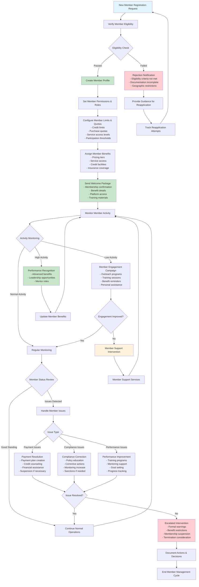
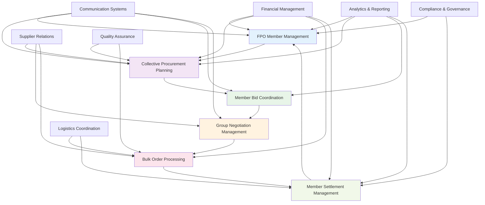

# Collaborator-Buyer-FPO-Admins Mermaid Workflow Diagrams

## Workflow 1: FPO Member Management

## Workflow 2: Collective Procurement Planning

```mermaid
flowchart TD
    A[Initiate Procurement Planning] --> B[Member Needs Assessment]
    B --> C[Survey Member Requirements<br/>- Product specifications<br/>- Quantity needs<br/>- Quality standards<br/>- Budget constraints<br/>- Timeline preferences]

    C --> D[Analyze Market Opportunities<br/>- Seasonal demand patterns<br/>- Price trend analysis<br/>- Supplier availability<br/>- Quality assessments<br/>- Logistics considerations]

    D --> E[Aggregate Member Demands]
    E --> F[Calculate Total Requirements<br/>- Quantity consolidation<br/>- Quality standardization<br/>- Delivery coordination<br/>- Payment aggregation]

    F --> G{Minimum Volume Achieved?}
    G -->|No| H[Member Outreach Campaign<br/>- Additional member recruitment<br/>- Requirement adjustments<br/>- Alternative product consideration<br/>- Timeline modifications]
    G -->|Yes| I[Develop Procurement Strategy]

    H --> J{Additional Participation?}
    J -->|No| K[Consider Alternative Approaches<br/>- Individual procurement<br/>- Smaller group formation<br/>- Different product focus<br/>- External partnerships]
    J -->|Yes| F

    I --> L[Supplier Identification & Evaluation<br/>- Supplier research<br/>- Capability assessment<br/>- Quality verification<br/>- Reliability evaluation<br/>- Pricing analysis]

    L --> M[Request Supplier Proposals]
    M --> N[Evaluate Proposals<br/>- Price comparison<br/>- Quality assessment<br/>- Terms evaluation<br/>- Delivery capability<br/>- Payment terms]

    N --> O{Suitable Proposals?}
    O -->|No| P[Expand Supplier Search<br/>- New supplier identification<br/>- Requirement modifications<br/>- Terms adjustments<br/>- Timeline extensions]
    O -->|Yes| Q[Shortlist Suppliers]

    P --> L
    Q --> R[Negotiate Terms & Conditions<br/>- Price negotiations<br/>- Quality agreements<br/>- Delivery schedules<br/>- Payment terms<br/>- Risk allocation]

    R --> S{Negotiation Successful?}
    S -->|No| T[Alternative Negotiation Strategies<br/>- Different suppliers<br/>- Modified requirements<br/>- Flexible terms<br/>- Phased procurement]
    S -->|Yes| U[Member Consultation & Approval]

    T --> Q
    U --> V[Present Procurement Plan to Members<br/>- Detailed proposal<br/>- Cost breakdown<br/>- Quality specifications<br/>- Timeline<br/>- Individual allocations]

    V --> W{Member Approval?}
    W -->|No| X[Address Member Concerns<br/>- Plan modifications<br/>- Cost adjustments<br/>- Quality improvements<br/>- Timeline changes]
    W -->|Yes| Y[Finalize Procurement Plan]

    X --> Z{Concerns Resolved?}
    Z -->|No| AA[Reconsider Procurement Approach]
    Z -->|Yes| Y

    Y --> BB[Execute Procurement Strategy<br/>- Supplier agreements<br/>- Order placement<br/>- Payment processing<br/>- Delivery coordination<br/>- Quality monitoring]

    BB --> CC[Monitor Procurement Progress]
    CC --> DD[Manage Delivery & Distribution]
    DD --> EE[Process Member Settlements]
    EE --> FF[Evaluate Procurement Performance]

    K --> GG[Document Alternative Decisions]
    AA --> GG
    FF --> HH[Generate Procurement Report]
    GG --> HH
    HH --> II[End Procurement Planning]

    style A fill:#e1f5fe
    style Y fill:#c8e6c9
    style BB fill:#c8e6c9
    style FF fill:#c8e6c9
    style H fill:#fff3e0
    style P fill:#fff3e0
    style X fill:#fff3e0
    style AA fill:#ffcdd2
```

## Workflow 3: Member Bid Coordination

```mermaid
flowchart TD
    A[Monitor Marketplace for Opportunities] --> B{Opportunity Identified?}
    B -->|No| C[Continue Monitoring]
    B -->|Yes| D[Evaluate Opportunity Suitability]

    C --> A
    D --> E[Assess Opportunity Details<br/>- Product specifications<br/>- Quantity requirements<br/>- Pricing expectations<br/>- Quality standards<br/>- Timeline constraints]

    E --> F{Opportunity Suitable for FPO?}
    F -->|No| G[Log Opportunity as Unsuitable]
    F -->|Yes| H[Analyze Member Interest Potential]

    G --> A
    H --> I[Survey Member Interest<br/>- Product appeal assessment<br/>- Capacity evaluation<br/>- Budget alignment<br/>- Timeline compatibility]

    I --> J{Sufficient Member Interest?}
    J -->|No| K[Insufficient Interest Response<br/>- Alternative approaches<br/>- Member education<br/>- Benefit highlighting<br/>- Requirement adjustments]
    J -->|Yes| L[Coordinate Member Participation]

    K --> M{Reconsider Opportunity?}
    M -->|No| G
    M -->|Yes| H

    L --> N[Collect Member Commitments<br/>- Quantity requirements<br/>- Quality preferences<br/>- Budget constraints<br/>- Payment capabilities<br/>- Delivery preferences]

    N --> O[Aggregate Member Requirements]
    O --> P[Develop Collective Bidding Strategy<br/>- Optimal bid amounts<br/>- Bidding timeline<br/>- Risk management<br/>- Contingency plans]

    P --> Q[Prepare Bid Documentation<br/>- Technical specifications<br/>- Member commitments<br/>- Payment guarantees<br/>- Delivery arrangements<br/>- Quality assurances]

    Q --> R[Submit Collective Bid]
    R --> S[Monitor Bid Progress<br/>- Competition analysis<br/>- Bid status tracking<br/>- Market response<br/>- Strategic adjustments]

    S --> T{Bid Status Update}
    T -->|Outbid| U[Evaluate Counter-Bid Options<br/>- Member consultation<br/>- Budget reassessment<br/>- Strategic adjustments<br/>- Alternative approaches]
    T -->|Leading| V[Maintain Bid Position]
    T -->|Won| W[Process Winning Bid]

    U --> X{Counter-Bid Approved?}
    X -->|No| Y[Accept Bid Loss]
    X -->|Yes| Z[Submit Counter-Bid]

    Z --> S
    V --> S

    W --> AA[Notify Members of Win]
    AA --> BB[Coordinate Order Processing<br/>- Individual allocations<br/>- Payment coordination<br/>- Delivery arrangements<br/>- Quality verification]

    BB --> CC[Manage Order Fulfillment]
    CC --> DD[Process Member Settlements<br/>- Individual payments<br/>- Cost allocations<br/>- Benefit distributions<br/>- Administrative fees]

    DD --> EE[Evaluate Bid Performance<br/>- Cost effectiveness<br/>- Member satisfaction<br/>- Quality outcomes<br/>- Process improvements]

    Y --> FF[Analyze Bid Loss<br/>- Cause analysis<br/>- Strategy review<br/>- Learning capture<br/>- Future improvements]

    EE --> GG[Generate Bid Report]
    FF --> GG
    GG --> HH[Update Bidding Strategy]
    HH --> A

    style A fill:#e1f5fe
    style R fill:#c8e6c9
    style W fill:#c8e6c9
    style EE fill:#c8e6c9
    style K fill:#fff3e0
    style U fill:#fff3e0
    style Y fill:#ffcdd2
```

## Workflow 4: Group Negotiation Management

```mermaid
flowchart TD
    A[Identify Negotiation Opportunity] --> B[Assess Group Negotiating Power]
    B --> C[Evaluate Collective Leverage<br/>- Member volume potential<br/>- Market positioning<br/>- Relationship strength<br/>- Competitive alternatives<br/>- Timing advantages]

    C --> D[Research Market Conditions<br/>- Current pricing trends<br/>- Competitor offerings<br/>- Supplier dynamics<br/>- Market demand/supply<br/>- Seasonal factors]

    D --> E[Define Negotiation Objectives<br/>- Target pricing<br/>- Quality requirements<br/>- Service levels<br/>- Payment terms<br/>- Delivery conditions]

    E --> F[Prepare Member Requirements Documentation<br/>- Aggregate volumes<br/>- Specification standards<br/>- Timeline requirements<br/>- Payment capabilities<br/>- Risk tolerances]

    F --> G[Identify Target Suppliers]
    G --> H[Initiate Supplier Contact<br/>- Introduction meetings<br/>- Capability presentations<br/>- Requirement discussions<br/>- Relationship building]

    H --> I[Request Supplier Proposals<br/>- Detailed specifications<br/>- Volume commitments<br/>- Quality standards<br/>- Service requirements<br/>- Competitive bidding]

    I --> J{Proposals Received?}
    J -->|No| K[Follow-up with Suppliers<br/>- Clarify requirements<br/>- Address concerns<br/>- Extend deadlines<br/>- Expand supplier pool]
    J -->|Yes| L[Evaluate Proposals]

    K --> M{Additional Proposals?}
    M -->|No| N[Consider Alternative Approaches]
    M -->|Yes| L

    L --> O[Compare Supplier Offerings<br/>- Price analysis<br/>- Quality assessment<br/>- Service evaluation<br/>- Terms comparison<br/>- Risk assessment]

    O --> P[Shortlist Suppliers for Negotiation]
    P --> Q[Begin Formal Negotiations<br/>- Price negotiations<br/>- Terms discussions<br/>- Service agreements<br/>- Quality commitments<br/>- Risk allocations]

    Q --> R{Negotiation Progress?}
    R -->|Stalled| S[Adjust Negotiation Strategy<br/>- Modify approach<br/>- Alternative terms<br/>- Different suppliers<br/>- Requirement flexibility]
    R -->|Progressing| T[Continue Negotiations]
    R -->|Breakthrough| U[Finalize Preliminary Agreements]

    S --> V{Strategy Effective?}
    V -->|No| N
    V -->|Yes| T

    T --> R
    U --> W[Member Consultation on Agreements<br/>- Present negotiated terms<br/>- Explain benefits<br/>- Address concerns<br/>- Seek approval]

    W --> X{Member Approval?}
    X -->|No| Y[Address Member Concerns<br/>- Renegotiate terms<br/>- Modify agreements<br/>- Alternative suppliers<br/>- Requirement changes]
    X -->|Yes| Z[Finalize Agreements]

    Y --> AA{Concerns Addressable?}
    AA -->|No| N
    AA -->|Yes| BB[Modify Negotiation Approach]

    BB --> Q
    Z --> CC[Execute Agreements<br/>- Contract signing<br/>- Implementation planning<br/>- Communication protocols<br/>- Performance monitoring<br/>- Compliance tracking]

    CC --> DD[Monitor Agreement Performance<br/>- Service delivery<br/>- Quality compliance<br/>- Cost effectiveness<br/>- Member satisfaction<br/>- Supplier relationship]

    DD --> EE[Evaluate Negotiation Outcomes<br/>- Benefit analysis<br/>- Cost savings<br/>- Quality improvements<br/>- Service enhancements<br/>- Relationship strength]

    N --> FF[Document Alternative Decisions]
    EE --> GG[Generate Negotiation Report]
    FF --> GG
    GG --> HH[Update Negotiation Strategy]
    HH --> II[End Negotiation Process]

    style A fill:#e1f5fe
    style U fill:#c8e6c9
    style Z fill:#c8e6c9
    style CC fill:#c8e6c9
    style EE fill:#c8e6c9
    style S fill:#fff3e0
    style Y fill:#fff3e0
    style N fill:#ffcdd2
```

## Workflow 5: Bulk Order Processing

```mermaid
flowchart TD
    A[Receive Member Order Requests] --> B[Consolidate Order Requirements]
    B --> C[Validate Member Commitments<br/>- Financial capacity<br/>- Order authenticity<br/>- Delivery capability<br/>- Quality acceptance<br/>- Payment guarantees]

    C --> D{Validation Successful?}
    D -->|No| E[Handle Validation Issues<br/>- Member communication<br/>- Requirement clarification<br/>- Financial verification<br/>- Commitment adjustments]
    D -->|Yes| F[Aggregate Order Specifications]

    E --> G{Issues Resolved?}
    G -->|No| H[Remove Invalid Orders]
    G -->|Yes| F

    F --> I[Prepare Bulk Order Documentation<br/>- Total quantities<br/>- Quality specifications<br/>- Delivery requirements<br/>- Payment terms<br/>- Member allocations]

    I --> J[Select Approved Suppliers]
    J --> K[Submit Bulk Orders<br/>- Order placement<br/>- Contract confirmation<br/>- Payment arrangements<br/>- Delivery scheduling<br/>- Quality agreements]

    K --> L{Order Accepted?}
    L -->|No| M[Handle Order Rejection<br/>- Alternative suppliers<br/>- Requirement modifications<br/>- Terms renegotiation<br/>- Member consultation]
    L -->|Yes| N[Confirm Order Details]

    M --> O{Alternative Available?}
    O -->|No| P[Cancel Bulk Order Process]
    O -->|Yes| J

    N --> Q[Set Up Order Tracking<br/>- Progress monitoring<br/>- Milestone tracking<br/>- Communication protocols<br/>- Issue escalation<br/>- Status reporting]

    Q --> R[Monitor Order Progress]
    R --> S{Progress Status}
    S -->|On Track| T[Continue Monitoring]
    S -->|Delayed| U[Address Delays<br/>- Supplier communication<br/>- Timeline adjustments<br/>- Member notifications<br/>- Alternative arrangements]
    S -->|Issues| V[Handle Order Issues<br/>- Problem identification<br/>- Resolution planning<br/>- Supplier coordination<br/>- Member communication]

    T --> R
    U --> W{Delays Resolved?}
    W -->|No| X[Escalate Delay Management]
    W -->|Yes| T

    V --> Y{Issues Resolved?}
    Y -->|No| Z[Escalate Issue Management]
    Y -->|Yes| T

    X --> AA[Consider Order Modification<br/>- Partial delivery<br/>- Alternative products<br/>- Timeline extension<br/>- Cancellation options]
    Z --> AA

    AA --> BB{Modification Acceptable?}
    BB -->|No| P
    BB -->|Yes| CC[Implement Modifications]

    CC --> T
    R --> DD{Order Ready for Delivery?}
    DD -->|No| R
    DD -->|Yes| EE[Coordinate Delivery Logistics]

    EE --> FF[Arrange Member Distribution<br/>- Delivery scheduling<br/>- Location coordination<br/>- Quality inspection<br/>- Documentation handling<br/>- Payment processing]

    FF --> GG[Execute Distribution Process]
    GG --> HH[Process Member Payments<br/>- Individual settlements<br/>- Cost allocations<br/>- Payment confirmations<br/>- Receipt generation<br/>- Account updates]

    HH --> II[Handle Quality Issues<br/>- Inspection results<br/>- Quality complaints<br/>- Return processing<br/>- Replacement coordination<br/>- Compensation handling]

    II --> JJ[Generate Distribution Reports<br/>- Delivery confirmations<br/>- Quality assessments<br/>- Member satisfaction<br/>- Financial summaries<br/>- Performance metrics]

    P --> KK[Notify Members of Cancellation]
    JJ --> LL[Evaluate Bulk Order Performance]

    KK --> MM[Document Cancellation Reasons]
    LL --> NN[Update Order Processing Procedures]
    MM --> NN
    NN --> OO[End Bulk Order Process]

    H --> PP[Maintain Partial Order Capacity]
    PP --> F

    style A fill:#e1f5fe
    style N fill:#c8e6c9
    style GG fill:#c8e6c9
    style HH fill:#c8e6c9
    style LL fill:#c8e6c9
    style E fill:#fff3e0
    style U fill:#fff3e0
    style V fill:#fff3e0
    style P fill:#ffcdd2
    style X fill:#ffcdd2
    style Z fill:#ffcdd2
```

## Workflow 6: Member Settlement Management

```mermaid
flowchart TD
    A[Initiate Settlement Process] --> B[Calculate Member Obligations<br/>- Purchase amounts<br/>- Service fees<br/>- Administrative charges<br/>- Interest/penalties<br/>- Credits/adjustments]

    B --> C[Generate Settlement Statements<br/>- Detailed breakdowns<br/>- Transaction history<br/>- Payment schedules<br/>- Outstanding balances<br/>- Due dates]

    C --> D[Distribute Statements to Members]
    D --> E[Monitor Payment Collections]
    E --> F{Payment Status}

    F -->|Payment Received| G[Process Payment<br/>- Payment verification<br/>- Account updating<br/>- Receipt generation<br/>- Balance adjustment]
    F -->|Payment Overdue| H[Handle Overdue Payments<br/>- Payment reminders<br/>- Contact members<br/>- Payment plans<br/>- Collection procedures]
    F -->|Payment Disputes| I[Handle Payment Disputes<br/>- Dispute investigation<br/>- Documentation review<br/>- Member communication<br/>- Resolution procedures]

    G --> J[Update Member Accounts]
    H --> K{Payment Plan Needed?}
    I --> L{Dispute Valid?}

    K -->|Yes| M[Create Payment Plan<br/>- Installment scheduling<br/>- Interest calculations<br/>- Agreement documentation<br/>- Monitoring setup]
    K -->|No| N[Escalate Collection<br/>- Formal notices<br/>- Collection agencies<br/>- Legal procedures<br/>- Account restrictions]

    L -->|Yes| O[Adjust Settlement Amount<br/>- Correction calculations<br/>- Account adjustments<br/>- Revised statements<br/>- Member notification]
    L -->|No| P[Reject Dispute<br/>- Explanation provision<br/>- Supporting documentation<br/>- Appeal procedures<br/>- Collection continuation]

    M --> Q[Monitor Payment Plan Compliance]
    N --> R[Document Collection Actions]
    O --> S[Process Adjusted Payments]
    P --> T[Continue Collection Process]

    Q --> U{Plan Compliance?}
    U -->|Compliant| V[Continue Plan Monitoring]
    U -->|Non-Compliant| W[Plan Modification or Escalation]

    V --> X{Plan Completed?}
    X -->|No| Q
    X -->|Yes| J

    W --> Y{Modification Possible?}
    Y -->|Yes| Z[Revise Payment Plan]
    Y -->|No| N

    Z --> Q
    R --> AA[Update Member Status]
    S --> J
    T --> H

    J --> BB[Process Supplier Payments<br/>- Calculate supplier dues<br/>- Payment scheduling<br/>- Invoice processing<br/>- Payment execution<br/>- Confirmation tracking]

    BB --> CC[Manage FPO Finances<br/>- Administrative expenses<br/>- Reserve allocations<br/>- Investment activities<br/>- Profit distribution<br/>- Financial reporting]

    CC --> DD[Generate Financial Reports<br/>- Member statements<br/>- FPO financial status<br/>- Cash flow analysis<br/>- Profitability reports<br/>- Compliance documentation]

    DD --> EE[Conduct Financial Audits<br/>- Internal audits<br/>- External audits<br/>- Compliance checks<br/>- Member transparency<br/>- Regulatory reporting]

    EE --> FF[Distribute Financial Reports<br/>- Member communications<br/>- Transparency reports<br/>- Regulatory submissions<br/>- Board presentations<br/>- Public disclosures]

    AA --> GG[Update Member Standing]
    FF --> HH[Monitor Financial Performance]
    GG --> HH

    HH --> II{Performance Satisfactory?}
    II -->|Yes| JJ[Continue Operations]
    II -->|No| KK[Implement Improvements<br/>- Process optimization<br/>- System upgrades<br/>- Training programs<br/>- Policy adjustments<br/>- Member support]

    JJ --> LL[End Settlement Cycle]
    KK --> MM[Monitor Improvement Effectiveness]
    MM --> HH

    style A fill:#e1f5fe
    style G fill:#c8e6c9
    style J fill:#c8e6c9
    style BB fill:#c8e6c9
    style DD fill:#c8e6c9
    style FF fill:#c8e6c9
    style H fill:#fff3e0
    style I fill:#fff3e0
    style N fill:#ffcdd2
    style W fill:#ffcdd2
```

## Cross-Workflow Integration Diagram

