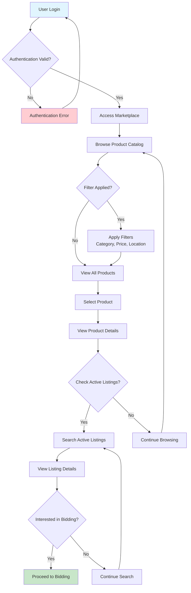
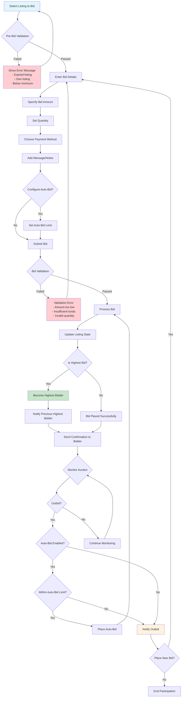
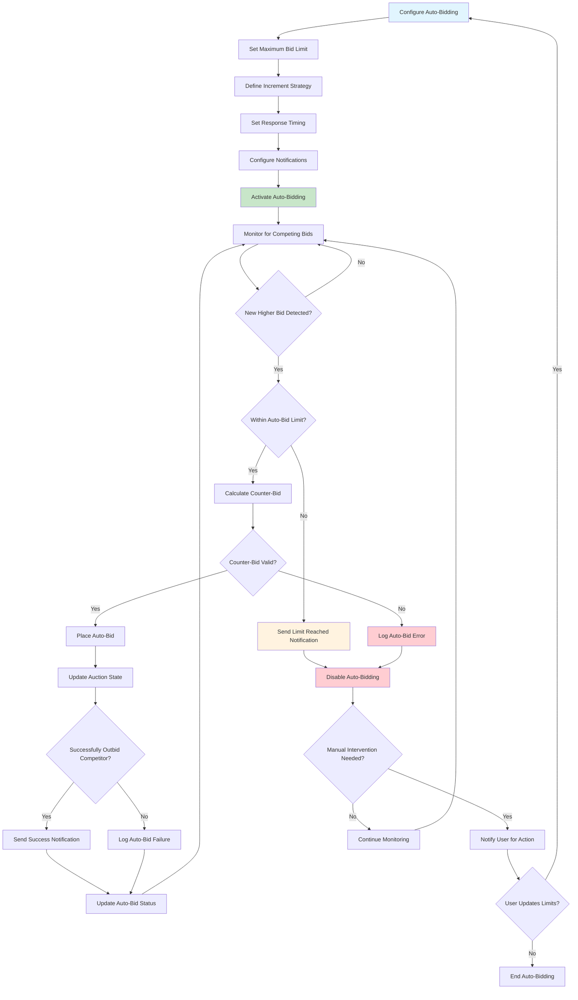
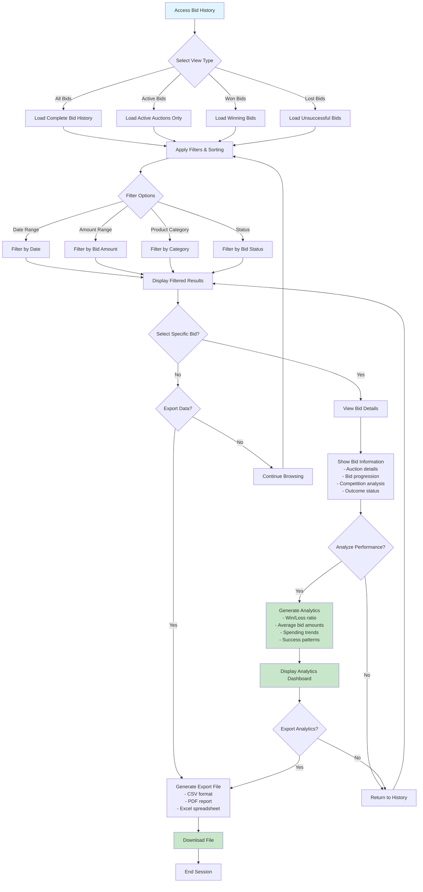
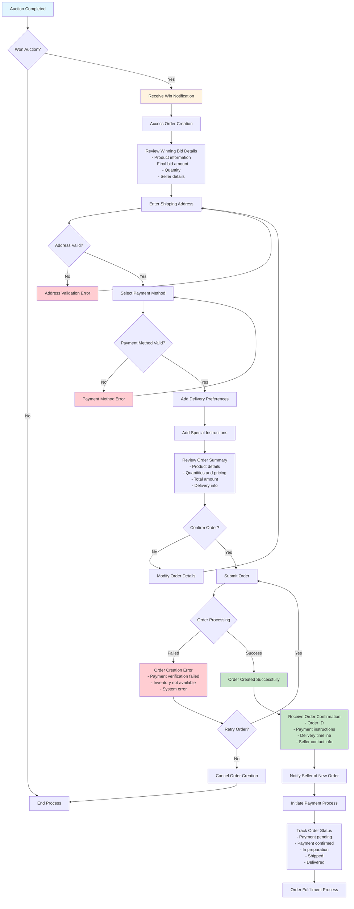
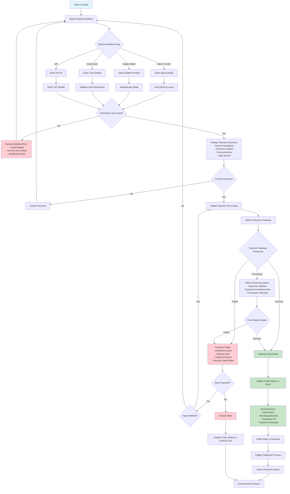
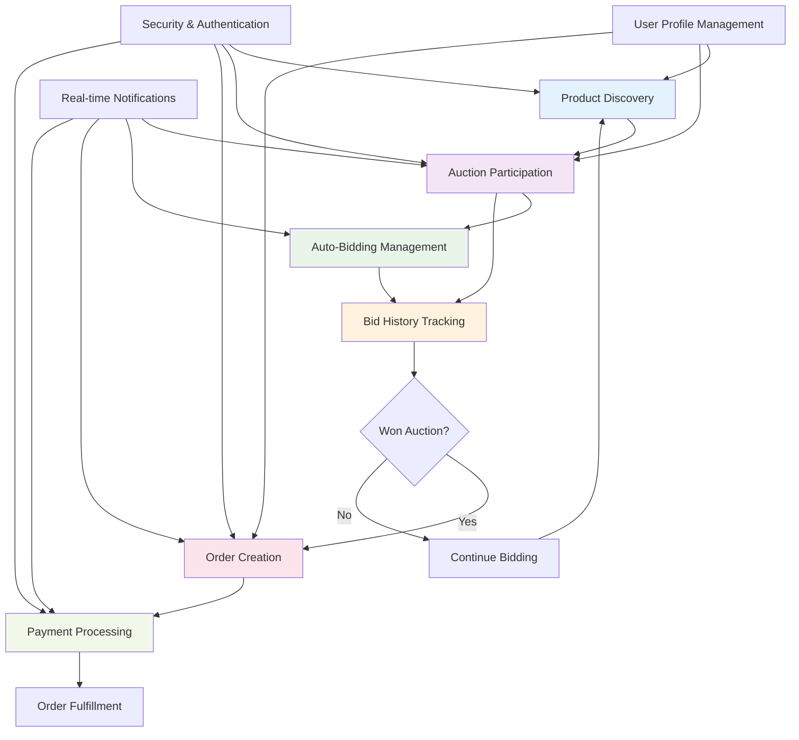

# Collaborator-Buyer Mermaid Workflow Diagrams

## Workflow 1: Product Discovery & Browsing

## Workflow 2: Auction Participation & Bidding

## Workflow 3: Auto-Bidding Management

## Workflow 4: Bid History Tracking

## Workflow 5: Order Creation from Winning Bids

## Workflow 6: Payment Processing

## Cross-Workflow Integration Diagram

