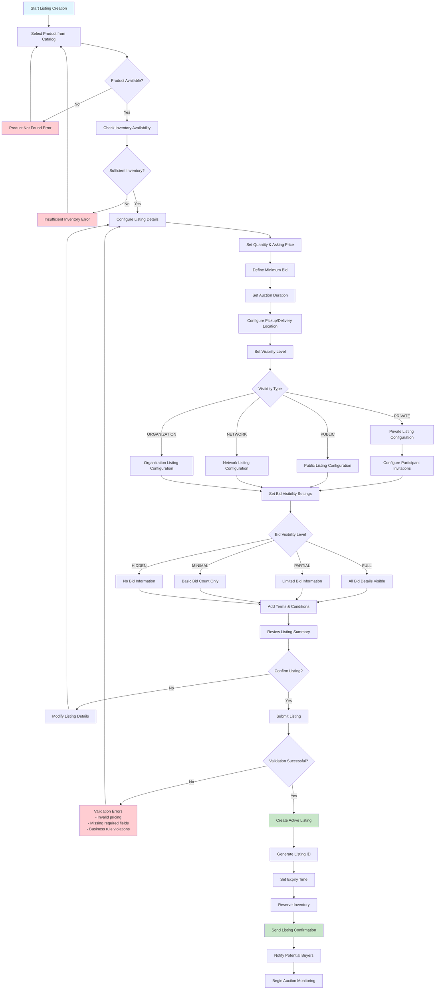
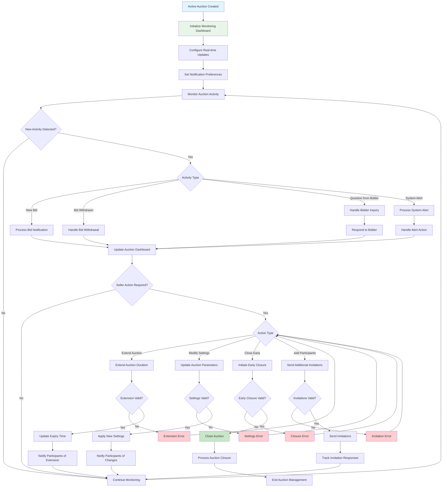
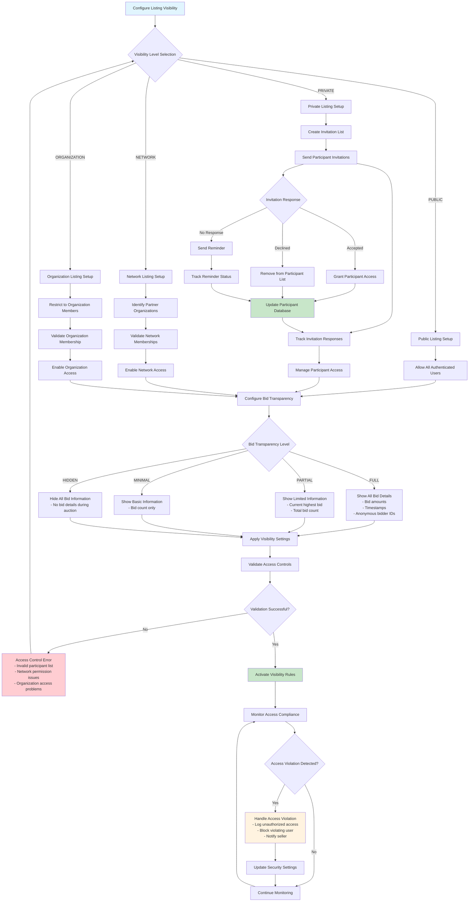
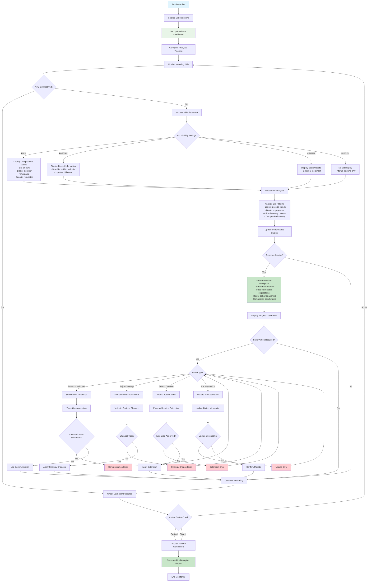
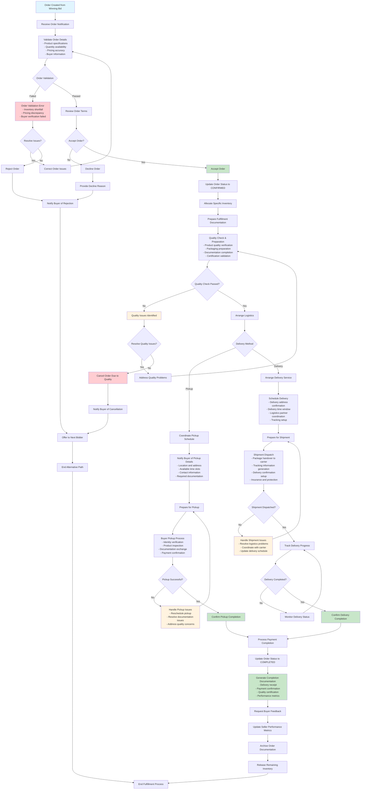
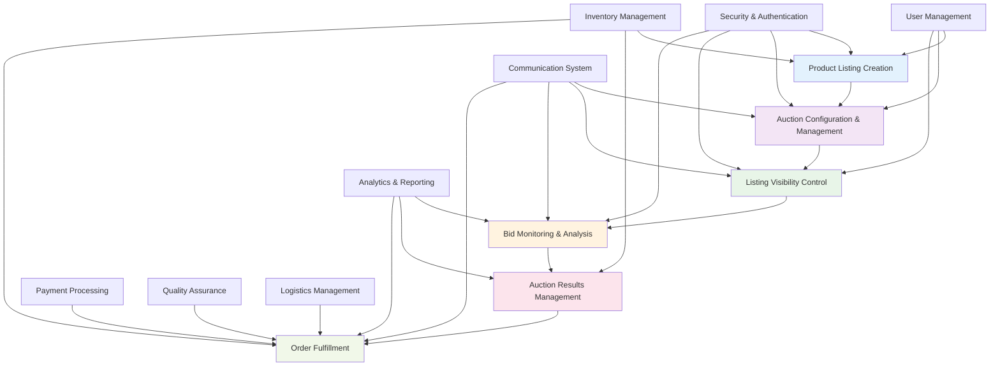

# Collaborator-Seller (Lister) Mermaid Workflow Diagrams

## Workflow 1: Product Listing Creation



## Workflow 2: Auction Configuration & Management



## Workflow 3: Listing Visibility Control



## Workflow 4: Bid Monitoring & Analysis



## Workflow 5: Auction Results Management

```mermaid
flowchart TD
    A[Auction Expiry Time Reached] --> B{Auction Closure Type}
    B -->|Automatic| C[System Auto-Close]
    B -->|Manual| D[Seller Initiated Close]
    B -->|Admin Force Close| E[Admin Intervention]

    C --> F[Validate Auction State]
    D --> G[Validate Close Permission]
    E --> H[Process Admin Close]

    F --> I{Validation Result}
    G --> I
    H --> I

    I -->|Failed| J[Close Validation Error<br/>- Active bids in process<br/>- System conflicts<br/>- Permission issues]
    I -->|Passed| K[Determine Winning Bid]

    J --> L[Handle Closure Error]
    L --> M{Retry Closure?}
    M -->|Yes| F
    M -->|No| N[Escalate to Admin]

    K --> O{Bids Exist?}
    O -->|No| P[No Bids Scenario]
    O -->|Yes| Q[Identify Highest Valid Bid]

    P --> R[Mark as EXPIRED_NO_BIDS]
    R --> S[Notify Seller of No Bids]
    S --> T[Release Reserved Inventory]
    T --> U[Generate No-Bid Report]

    Q --> V{Multiple Same Amount Bids?}
    V -->|Yes| W[Apply Tie-Breaking Rules<br/>- First bid wins (timestamp)<br/>- Higher quantity preference<br/>- Bidder rating consideration]
    V -->|No| X[Declare Winner]

    W --> X
    X --> Y[Validate Winning Bid]
    Y --> Z{Winner Validation}
    Z -->|Failed| AA[Winner Validation Error<br/>- Bid no longer valid<br/>- Bidder account issues<br/>- Payment verification failed]
    Z -->|Passed| BB[Confirm Auction Winner]

    AA --> CC[Select Next Valid Bid]
    CC --> Y

    BB --> DD[Update Auction Status to CLOSED]
    DD --> EE[Notify Winner]
    EE --> FF[Notify Other Bidders]
    FF --> GG[Notify Seller]

    GG --> HH[Generate Auction Results Report<br/>- Final winning bid<br/>- Total bid count<br/>- Bid progression<br/>- Performance metrics]

    HH --> II[Create Order Opportunity]
    II --> JJ[Set Order Creation Deadline]
    JJ --> KK[Monitor Order Creation]

    KK --> LL{Order Created by Winner?}
    LL -->|Yes| MM[Process Order]
    LL -->|No| NN{Deadline Expired?}
    NN -->|No| KK
    NN -->|Yes| OO[Offer to Next Bidder]

    MM --> PP[Begin Fulfillment Process]
    OO --> QQ{Next Bidder Accepts?}
    QQ -->|Yes| MM
    QQ -->|No| RR[Continue to Next Bidder]
    RR --> OO

    PP --> SS[Update Seller Performance Metrics]
    U --> SS
    SS --> TT[Archive Auction Data]
    TT --> UU[End Results Management]

    N --> VV[Admin Intervention Required]
    VV --> UU

    style A fill:#e1f5fe
    style BB fill:#c8e6c9
    style HH fill:#c8e6c9
    style PP fill:#c8e6c9
    style J fill:#ffcdd2
    style AA fill:#ffcdd2
    style N fill:#fff3e0
    style VV fill:#fff3e0
```

## Workflow 6: Order Fulfillment



## Cross-Workflow Integration Diagram


