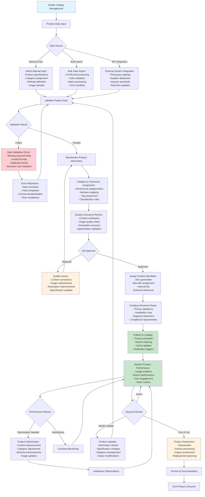
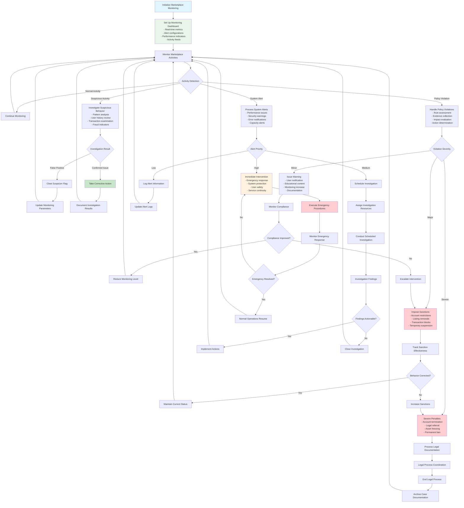
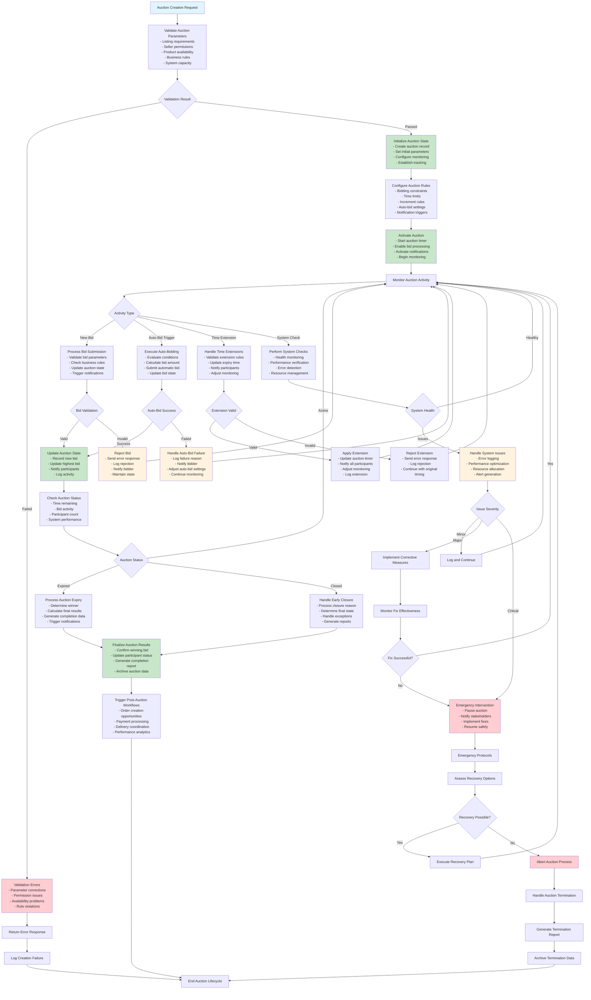
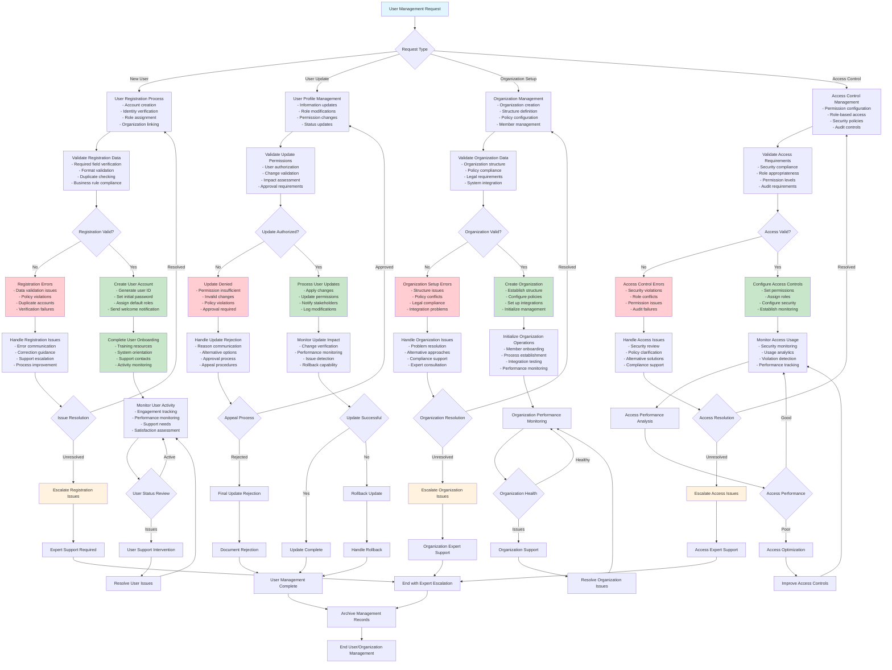
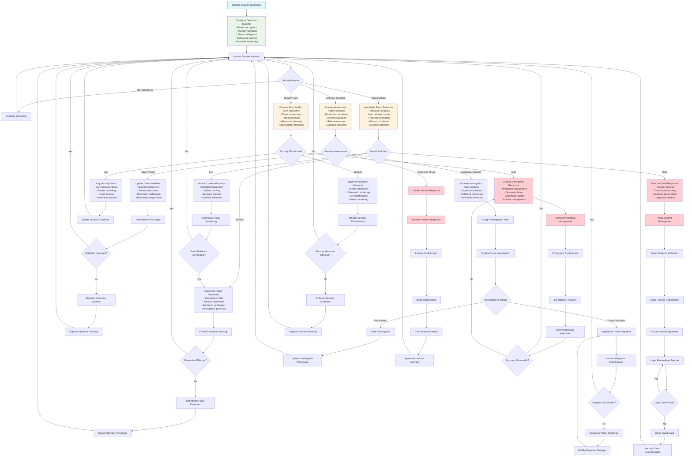
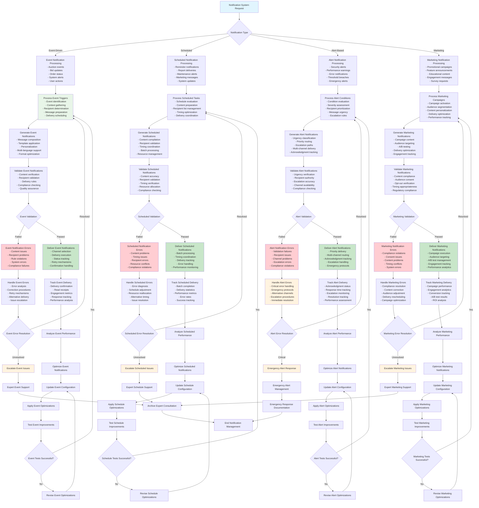
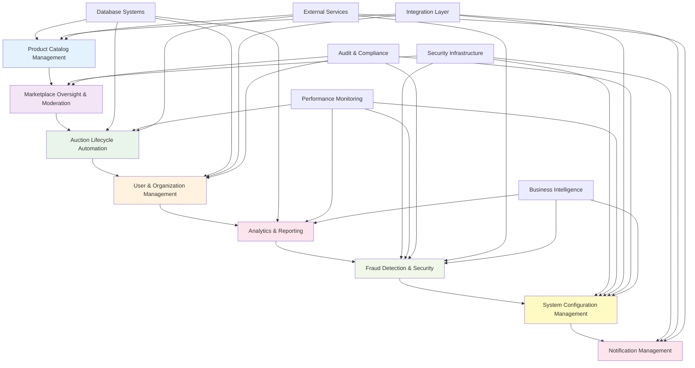

# KisanLink System/Admin Mermaid Workflow Diagrams

## Workflow 1: Product Catalog Management

## Workflow 2: Marketplace Oversight & Moderation

## Workflow 3: Auction Lifecycle Automation

## Workflow 4: User & Organization Management

## Workflow 5: Analytics & Reporting

```mermaid
flowchart TD
    A[Initialize Analytics & Reporting] --> B{Analytics Type}

    B -->|Platform Performance| C[Platform Analytics<br/>- System performance metrics<br/>- API usage statistics<br/>- Response time analysis<br/>- Error rate tracking<br/>- Capacity utilization]

    B -->|Business Metrics| D[Business Analytics<br/>- Transaction volumes<br/>- Revenue analysis<br/>- User engagement<br/>- Conversion rates<br/>- Growth metrics]

    B -->|User Behavior| E[User Analytics<br/>- Navigation patterns<br/>- Feature usage<br/>- Session analysis<br/>- Retention metrics<br/>- Satisfaction scores]

    B -->|Marketplace Performance| F[Marketplace Analytics<br/>- Listing performance<br/>- Auction success rates<br/>- Bidding patterns<br/>- Market trends<br/>- Price analysis]

    C --> G[Collect Platform Data<br/>- System logs<br/>- Performance counters<br/>- Error reports<br/>- Resource usage<br/>- Health metrics]

    D --> H[Collect Business Data<br/>- Transaction records<br/>- Financial data<br/>- User activities<br/>- Revenue streams<br/>- Cost structures]

    E --> I[Collect User Data<br/>- Click streams<br/>- Session logs<br/>- Feature interactions<br/>- Feedback data<br/>- Support tickets]

    F --> J[Collect Marketplace Data<br/>- Listing records<br/>- Auction histories<br/>- Bid transactions<br/>- Price movements<br/>- Market activities]

    G --> K[Process Platform Metrics<br/>- Performance calculations<br/>- Trend analysis<br/>- Anomaly detection<br/>- Threshold monitoring<br/>- Alert generation]

    H --> L[Process Business Metrics<br/>- Revenue calculations<br/>- Growth analysis<br/>- Profitability assessment<br/>- Market share<br/>- Competitive analysis]

    I --> M[Process User Metrics<br/>- Behavior analysis<br/>- Segmentation<br/>- Journey mapping<br/>- Satisfaction scoring<br/>- Churn prediction]

    J --> N[Process Marketplace Metrics<br/>- Success rate analysis<br/>- Price trend analysis<br/>- Demand patterns<br/>- Competition metrics<br/>- Market efficiency]

    K --> O{Platform Performance}
    L --> P{Business Performance}
    M --> Q{User Engagement}
    N --> R{Marketplace Health}

    O -->|Good| S[Continue Monitoring]
    O -->|Issues| T[Generate Performance Alerts<br/>- System bottlenecks<br/>- Performance degradation<br/>- Capacity warnings<br/>- Error spikes<br/>- Resource constraints]

    P -->|Positive| U[Track Growth Trends]
    P -->|Concerning| V[Generate Business Alerts<br/>- Revenue decline<br/>- Growth slowdown<br/>- Cost increases<br/>- Market share loss<br/>- Competitive threats]

    Q -->|High| W[Optimize User Experience]
    Q -->|Low| X[Generate Engagement Alerts<br/>- Usage decline<br/>- Feature abandonment<br/>- Satisfaction drops<br/>- Support increases<br/>- Churn risks]

    R -->|Healthy| Y[Monitor Market Trends]
    R -->|Problems| Z[Generate Marketplace Alerts<br/>- Success rate decline<br/>- Price volatility<br/>- Demand shifts<br/>- Competition impacts<br/>- Efficiency issues]

    S --> AA[Generate Performance Reports<br/>- System health dashboards<br/>- Performance summaries<br/>- Trend visualizations<br/>- Capacity planning<br/>- Optimization recommendations]

    T --> BB[Investigate Performance Issues<br/>- Root cause analysis<br/>- Impact assessment<br/>- Resolution planning<br/>- Implementation tracking<br/>- Effectiveness monitoring]

    U --> CC[Generate Business Reports<br/>- Financial dashboards<br/>- Growth analytics<br/>- Market analysis<br/>- Profitability reports<br/>- Strategic insights]

    V --> DD[Investigate Business Issues<br/>- Performance analysis<br/>- Market research<br/>- Competitive assessment<br/>- Strategy review<br/>- Action planning]

    W --> EE[Generate User Reports<br/>- Engagement dashboards<br/>- Behavior analytics<br/>- Satisfaction reports<br/>- Usage patterns<br/>- Improvement opportunities]

    X --> FF[Investigate User Issues<br/>- Experience analysis<br/>- Journey optimization<br/>- Feature improvement<br/>- Support enhancement<br/>- Satisfaction recovery]

    Y --> GG[Generate Marketplace Reports<br/>- Market health dashboards<br/>- Trend analysis<br/>- Performance metrics<br/>- Success factors<br/>- Growth opportunities]

    Z --> HH[Investigate Marketplace Issues<br/>- Market analysis<br/>- Competition review<br/>- User feedback<br/>- Process improvement<br/>- Strategy adjustment]

    AA --> II[Distribute Performance Reports<br/>- Technical teams<br/>- Management dashboards<br/>- Stakeholder updates<br/>- Automated alerts<br/>- Archive storage]

    BB --> JJ{Performance Resolution}
    CC --> KK[Distribute Business Reports<br/>- Executive dashboards<br/>- Board presentations<br/>- Investor updates<br/>- Strategic planning<br/>- Performance tracking]

    DD --> LL{Business Resolution}
    EE --> MM[Distribute User Reports<br/>- Product teams<br/>- UX designers<br/>- Support teams<br/>- Marketing teams<br/>- Development priorities]

    FF --> NN{User Resolution}
    GG --> OO[Distribute Marketplace Reports<br/>- Operations teams<br/>- Business development<br/>- Market analysts<br/>- Strategy teams<br/>- External partners]

    HH --> PP{Marketplace Resolution}

    JJ -->|Resolved| S
    JJ -->|Ongoing| QQ[Monitor Resolution Progress]
    LL -->|Resolved| U
    LL -->|Ongoing| RR[Monitor Business Improvements]
    NN -->|Resolved| W
    NN -->|Ongoing| SS[Monitor User Improvements]
    PP -->|Resolved| Y
    PP -->|Ongoing| TT[Monitor Marketplace Improvements]

    QQ --> UU{Resolution Complete?}
    RR --> VV{Business Improvement Complete?}
    SS --> WW{User Improvement Complete?}
    TT --> XX{Marketplace Improvement Complete?}

    UU -->|Yes| S
    UU -->|No| QQ
    VV -->|Yes| U
    VV -->|No| RR
    WW -->|Yes| W
    WW -->|No| SS
    XX -->|Yes| Y
    XX -->|No| TT

    II --> YY[Archive Performance Data]
    KK --> ZZ[Archive Business Data]
    MM --> AAA[Archive User Data]
    OO --> BBB[Archive Marketplace Data]

    YY --> CCC[Schedule Next Analysis Cycle]
    ZZ --> CCC
    AAA --> CCC
    BBB --> CCC

    CCC --> DDD[End Analytics Cycle]

    style A fill:#e1f5fe
    style G fill:#e8f5e8
    style K fill:#c8e6c9
    style AA fill:#c8e6c9
    style CC fill:#c8e6c9
    style EE fill:#c8e6c9
    style GG fill:#c8e6c9
    style T fill:#fff3e0
    style V fill:#fff3e0
    style X fill:#fff3e0
    style Z fill:#fff3e0
    style BB fill:#ffcdd2
    style DD fill:#ffcdd2
    style FF fill:#ffcdd2
    style HH fill:#ffcdd2
```

## Workflow 6: Fraud Detection & Security

## Workflow 7: System Configuration Management

```mermaid
flowchart TD
    A[Configuration Management Request] --> B{Configuration Type}

    B -->|Platform Settings| C[Platform Configuration<br/>- System parameters<br/>- Performance settings<br/>- Resource allocation<br/>- Environment variables<br/>- Feature toggles]

    B -->|Business Rules| D[Business Rule Configuration<br/>- Marketplace policies<br/>- Pricing rules<br/>- Validation logic<br/>- Workflow parameters<br/>- Compliance settings]

    B -->|Integration Setup| E[Integration Configuration<br/>- API configurations<br/>- Third-party services<br/>- Data synchronization<br/>- Authentication setup<br/>- Communication protocols]

    B -->|Security Policies| F[Security Configuration<br/>- Access controls<br/>- Authentication rules<br/>- Encryption settings<br/>- Audit parameters<br/>- Compliance policies]

    C --> G[Validate Platform Settings<br/>- Parameter verification<br/>- Compatibility checking<br/>- Performance impact<br/>- Security implications<br/>- Resource requirements]

    D --> H[Validate Business Rules<br/>- Logic verification<br/>- Consistency checking<br/>- Impact assessment<br/>- Compliance validation<br/>- Stakeholder approval]

    E --> I[Validate Integration Config<br/>- Connectivity testing<br/>- Authentication verification<br/>- Data format validation<br/>- Performance testing<br/>- Security assessment]

    F --> J[Validate Security Config<br/>- Policy compliance<br/>- Security effectiveness<br/>- Access verification<br/>- Audit trail setup<br/>- Regulatory compliance]

    G --> K{Platform Validation}
    H --> L{Business Rule Validation}
    I --> M{Integration Validation}
    J --> N{Security Validation}

    K -->|Failed| O[Platform Config Errors<br/>- Invalid parameters<br/>- Compatibility issues<br/>- Performance risks<br/>- Security concerns<br/>- Resource conflicts]

    K -->|Passed| P[Apply Platform Configuration<br/>- Parameter updates<br/>- System restarts<br/>- Performance monitoring<br/>- Impact verification<br/>- Documentation update]

    L -->|Failed| Q[Business Rule Errors<br/>- Logic inconsistencies<br/>- Validation conflicts<br/>- Compliance issues<br/>- Stakeholder objections<br/>- Impact concerns]

    L -->|Passed| R[Deploy Business Rules<br/>- Rule implementation<br/>- Validation setup<br/>- Testing verification<br/>- Impact monitoring<br/>- Documentation update]

    M -->|Failed| S[Integration Config Errors<br/>- Connectivity failures<br/>- Authentication issues<br/>- Data format problems<br/>- Performance issues<br/>- Security vulnerabilities]

    M -->|Passed| T[Activate Integration<br/>- Connection establishment<br/>- Data synchronization<br/>- Performance monitoring<br/>- Error handling<br/>- Documentation update]

    N -->|Failed| U[Security Config Errors<br/>- Policy violations<br/>- Security weaknesses<br/>- Access problems<br/>- Audit failures<br/>- Compliance issues]

    N -->|Passed| V[Implement Security Config<br/>- Policy activation<br/>- Access control setup<br/>- Audit system start<br/>- Monitoring activation<br/>- Documentation update]

    O --> W[Handle Platform Issues<br/>- Error resolution<br/>- Alternative configurations<br/>- Expert consultation<br/>- Testing procedures<br/>- Risk mitigation]

    P --> X[Monitor Platform Performance<br/>- Performance metrics<br/>- System stability<br/>- Resource utilization<br/>- Error monitoring<br/>- User impact]

    Q --> Y[Handle Business Rule Issues<br/>- Logic correction<br/>- Stakeholder consultation<br/>- Alternative approaches<br/>- Testing procedures<br/>- Impact assessment]

    R --> Z[Monitor Rule Performance<br/>- Validation effectiveness<br/>- Business impact<br/>- Compliance tracking<br/>- Error monitoring<br/>- User feedback]

    S --> AA[Handle Integration Issues<br/>- Configuration correction<br/>- Alternative approaches<br/>- Partner consultation<br/>- Testing procedures<br/>- Security verification]

    T --> BB[Monitor Integration Performance<br/>- Connection stability<br/>- Data accuracy<br/>- Performance metrics<br/>- Error tracking<br/>- Partner feedback]

    U --> CC[Handle Security Issues<br/>- Policy correction<br/>- Security enhancement<br/>- Compliance adjustment<br/>- Expert consultation<br/>- Risk assessment]

    V --> DD[Monitor Security Effectiveness<br/>- Policy compliance<br/>- Security metrics<br/>- Access monitoring<br/>- Audit tracking<br/>- Threat detection]

    W --> EE{Issue Resolution}
    X --> FF{Platform Stability}
    Y --> GG{Rule Issue Resolution}
    Z --> HH{Rule Effectiveness}
    AA --> II{Integration Issue Resolution}
    BB --> JJ{Integration Stability}
    CC --> KK{Security Issue Resolution}
    DD --> LL{Security Effectiveness}

    EE -->|Resolved| G
    EE -->|Unresolved| MM[Escalate Platform Issues]
    FF -->|Stable| NN[Platform Config Success]
    FF -->|Unstable| OO[Platform Rollback]
    GG -->|Resolved| H
    GG -->|Unresolved| PP[Escalate Rule Issues]
    HH -->|Effective| QQ[Rule Config Success]
    HH -->|Ineffective| RR[Rule Adjustment]
    II -->|Resolved| I
    II -->|Unresolved| SS[Escalate Integration Issues]
    JJ -->|Stable| TT[Integration Config Success]
    JJ -->|Unstable| UU[Integration Rollback]
    KK -->|Resolved| J
    KK -->|Unresolved| VV[Escalate Security Issues]
    LL -->|Effective| WW[Security Config Success]
    LL -->|Ineffective| XX[Security Enhancement]

    MM --> YY[Expert Platform Support]
    OO --> ZZ[Restore Previous Platform Config]
    PP --> AAA[Expert Rule Support]
    RR --> BBB[Modify Business Rules]
    SS --> CCC[Expert Integration Support]
    UU --> DDD[Restore Previous Integration]
    VV --> EEE[Expert Security Support]
    XX --> FFF[Enhance Security Measures]

    NN --> GGG[Document Platform Success]
    QQ --> HHH[Document Rule Success]
    TT --> III[Document Integration Success]
    WW --> JJJ[Document Security Success]
    YY --> KKK[Archive Expert Consultation]
    ZZ --> LLL[Document Platform Rollback]
    AAA --> KKK
    BBB --> R
    CCC --> KKK
    DDD --> MMM[Document Integration Rollback]
    EEE --> KKK
    FFF --> V

    GGG --> NNN[End Platform Configuration]
    HHH --> NNN
    III --> NNN
    JJJ --> NNN
    KKK --> NNN
    LLL --> NNN
    MMM --> NNN

    style A fill:#e1f5fe
    style P fill:#c8e6c9
    style R fill:#c8e6c9
    style T fill:#c8e6c9
    style V fill:#c8e6c9
    style O fill:#ffcdd2
    style Q fill:#ffcdd2
    style S fill:#ffcdd2
    style U fill:#ffcdd2
    style MM fill:#fff3e0
    style PP fill:#fff3e0
    style SS fill:#fff3e0
    style VV fill:#fff3e0
```

## Workflow 8: Notification Management

## Cross-Workflow Integration Diagram

