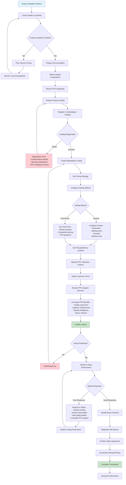
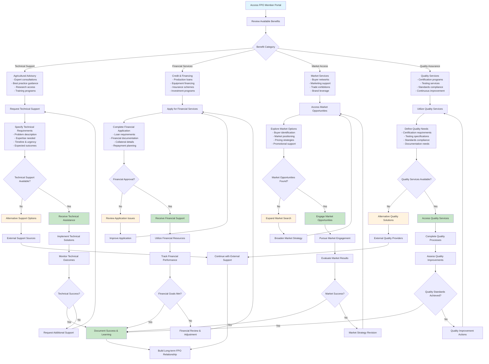
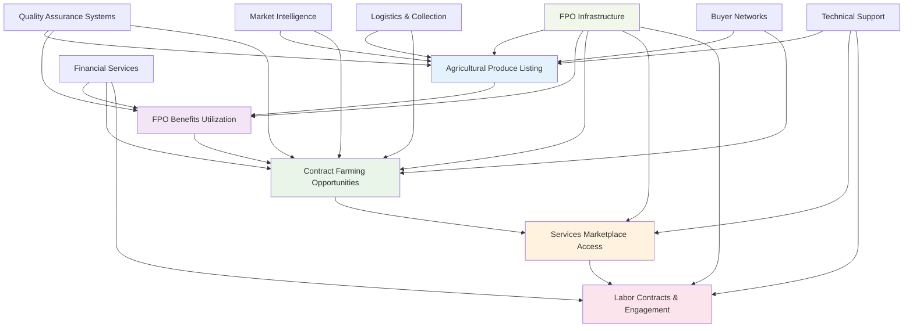

# User-Farmer-Under-FPO Mermaid Workflow Diagrams

## Workflow 1: Agricultural Produce Listing

## Workflow 2: Services Marketplace Access

```mermaid
flowchart TD
    A[Access Services Marketplace] --> B[Browse Available Services]
    B --> C{Service Category Filter}

    C -->|Technical Services| D[Agricultural Consultancy<br/>- Soil testing<br/>- Crop advisory<br/>- Pest management<br/>- Irrigation planning]
    C -->|Equipment Rental| E[Farm Equipment<br/>- Tractors & machinery<br/>- Irrigation systems<br/>- Harvesting equipment<br/>- Processing tools]
    C -->|Specialized Services| F[Professional Services<br/>- Veterinary care<br/>- Quality certification<br/>- Financial advisory<br/>- Legal consultation]

    D --> G[Filter by Location & Availability]
    E --> G
    F --> G

    G --> H[Review Service Providers]
    H --> I[Evaluate Provider Credentials<br/>- Experience & expertise<br/>- Certifications<br/>- Customer reviews<br/>- FPO network membership]

    I --> J{Provider Suitable?}
    J -->|No| K[Continue Search]
    J -->|Yes| L[Define Service Requirements]

    K --> G
    L --> M[Specify Service Scope<br/>- Detailed requirements<br/>- Timeline & duration<br/>- Location specifics<br/>- Budget constraints]

    M --> N[Contact Service Provider]
    N --> O[Request Service Proposal]
    O --> P{Proposal Received?}
    P -->|No| Q[Follow-up or Alternative Provider]
    P -->|Yes| R[Review Proposal Details]

    Q --> G
    R --> S[Negotiate Terms<br/>- Pricing & payment<br/>- Service scope<br/>- Timeline<br/>- Quality standards]

    S --> T{Terms Acceptable?}
    T -->|No| U[Modify Requirements or Find Alternative]
    T -->|Yes| V[Book Service]

    U --> N
    V --> W[Confirm Service Agreement]
    W --> X[Prepare for Service Delivery<br/>- Farm access arrangements<br/>- Resource preparation<br/>- Safety requirements<br/>- Documentation]

    X --> Y[Service Delivery Begins]
    Y --> Z[Monitor Service Quality]
    Z --> AA{Service Quality Satisfactory?}
    AA -->|No| BB[Address Quality Issues<br/>- Communicate concerns<br/>- Request improvements<br/>- Document problems]
    AA -->|Yes| CC[Continue Service Monitoring]

    BB --> DD{Issues Resolved?}
    DD -->|No| EE[Escalate or Terminate Service]
    DD -->|Yes| CC

    CC --> FF{Service Completed?}
    FF -->|No| Z
    FF -->|Yes| GG[Process Payment]

    GG --> HH[Evaluate Service Quality]
    HH --> II[Provide Feedback & Rating]
    II --> JJ[Build Provider Relationship]

    EE --> KK[Handle Service Termination]
    KK --> LL[Seek Alternative Provider]
    LL --> G

    style A fill:#e1f5fe
    style V fill:#c8e6c9
    style GG fill:#c8e6c9
    style II fill:#c8e6c9
    style BB fill:#fff3e0
    style EE fill:#ffcdd2
```

## Workflow 3: Labor Contracts & Engagement

```mermaid
flowchart TD
    A[Assess Labor Requirements] --> B[Plan Labor Needs<br/>- Seasonal activities<br/>- Specialized skills<br/>- Duration & timing<br/>- Budget planning]

    B --> C[Browse Labor Marketplace]
    C --> D{Labor Category}

    D -->|Seasonal Workers| E[General Farm Labor<br/>- Planting & harvesting<br/>- Field maintenance<br/>- Crop care<br/>- General assistance]
    D -->|Skilled Technicians| F[Specialized Labor<br/>- Irrigation specialists<br/>- Equipment operators<br/>- Quality inspectors<br/>- Processing technicians]
    D -->|Professional Services| G[Expert Services<br/>- Agricultural consultants<br/>- Veterinarians<br/>- Agronomists<br/>- Farm managers]

    E --> H[Filter by Location & Availability]
    F --> H
    G --> H

    H --> I[Review Worker Profiles]
    I --> J[Evaluate Worker Credentials<br/>- Work experience<br/>- Skill certifications<br/>- Previous employer reviews<br/>- Reliability indicators]

    J --> K{Worker Suitable?}
    K -->|No| L[Continue Search]
    K -->|Yes| M[Contact Worker/Agency]

    L --> H
    M --> N[Conduct Worker Interview<br/>- Skill assessment<br/>- Experience verification<br/>- Availability confirmation<br/>- Reference checking]

    N --> O{Interview Satisfactory?}
    O -->|No| P[Thank and Continue Search]
    O -->|Yes| Q[Negotiate Contract Terms]

    P --> H
    Q --> R[Define Work Agreement<br/>- Work scope & responsibilities<br/>- Duration & schedule<br/>- Compensation & benefits<br/>- Working conditions]

    R --> S[Establish Safety Requirements<br/>- Safety protocols<br/>- Equipment provision<br/>- Insurance coverage<br/>- Emergency procedures]

    S --> T{Agreement Reached?}
    T -->|No| U[Modify Terms or Find Alternative]
    T -->|Yes| V[Formalize Labor Contract]

    U --> Q
    V --> W[Coordinate Work Start<br/>- Farm access arrangements<br/>- Tool & equipment provision<br/>- Orientation & training<br/>- Schedule coordination]

    W --> X[Begin Work Activities]
    X --> Y[Monitor Work Progress<br/>- Quality assessment<br/>- Schedule adherence<br/>- Safety compliance<br/>- Performance tracking]

    Y --> Z{Work Quality Satisfactory?}
    Z -->|No| AA[Address Performance Issues<br/>- Provide feedback<br/>- Additional training<br/>- Performance improvement<br/>- Documentation]
    Z -->|Yes| BB[Continue Work Monitoring]

    AA --> CC{Improvement Achieved?}
    CC -->|No| DD[Consider Contract Termination]
    CC -->|Yes| BB

    BB --> EE{Work Period Completed?}
    EE -->|No| Y
    EE -->|Yes| FF[Process Final Payment]

    FF --> GG[Evaluate Worker Performance]
    GG --> HH[Provide Worker Feedback & Rating]
    HH --> II[Build Long-term Relationships]

    DD --> JJ[Handle Contract Termination<br/>- Final payments<br/>- Documentation<br/>- Find replacement worker]
    JJ --> H

    style A fill:#e1f5fe
    style V fill:#c8e6c9
    style FF fill:#c8e6c9
    style HH fill:#c8e6c9
    style AA fill:#fff3e0
    style DD fill:#ffcdd2
```

## Workflow 4: FPO Benefits & Support Utilization

## Workflow 5: Contract Farming & Agreements

```mermaid
flowchart TD
    A[Browse Contract Opportunities] --> B[Filter Contract Types]
    B --> C{Contract Category}

    C -->|Pre-Season Contracts| D[Advance Contracting<br/>- Crop commitment<br/>- Input supply<br/>- Price guarantee<br/>- Quality specifications]
    C -->|Spot Contracts| E[Immediate Contracting<br/>- Ready produce<br/>- Market price<br/>- Quick delivery<br/>- Standard terms]
    C -->|Long-term Agreements| F[Partnership Contracts<br/>- Multi-season commitment<br/>- Relationship building<br/>- Exclusive arrangements<br/>- Development support]

    D --> G[Evaluate Contract Terms]
    E --> G
    F --> G

    G --> H[Analyze Contract Details<br/>- Pricing structure<br/>- Quality requirements<br/>- Delivery schedules<br/>- Payment terms<br/>- Risk factors]

    H --> I{Contract Suitable?}
    I -->|No| J[Continue Search]
    I -->|Yes| K[Assess Farm Capability]

    J --> A
    K --> L[Evaluate Production Capacity<br/>- Land availability<br/>- Resource requirements<br/>- Technical capability<br/>- Financial capacity]

    L --> M{Capability Match?}
    M -->|No| N[Build Capacity or Find Alternative]
    M -->|Yes| O[Initiate Contract Negotiation]

    N --> A
    O --> P[Contact Contract Provider]
    P --> Q[Present Farm Profile & Capabilities]
    Q --> R[Negotiate Contract Terms<br/>- Price adjustments<br/>- Quality standards<br/>- Delivery flexibility<br/>- Risk sharing]

    R --> S{Negotiation Successful?}
    S -->|No| T[Modify Approach or Find Alternative]
    S -->|Yes| U[Finalize Contract Agreement]

    T --> O
    U --> V[Sign Contract Documentation]
    V --> W[Begin Contract Implementation]

    W --> X[Implement Farming Practices<br/>- Follow quality protocols<br/>- Meet production schedules<br/>- Monitor crop development<br/>- Maintain communication]

    X --> Y[Monitor Contract Compliance<br/>- Quality checkpoints<br/>- Progress reporting<br/>- Issue identification<br/>- Corrective actions]

    Y --> Z{Compliance Issues?}
    Z -->|Yes| AA[Address Compliance Problems<br/>- Identify root causes<br/>- Implement corrections<br/>- Communicate with buyer<br/>- Document actions]
    Z -->|No| BB[Continue Implementation]

    AA --> CC{Issues Resolved?}
    CC -->|No| DD[Escalate or Seek Support]
    CC -->|Yes| BB

    BB --> EE{Production Ready?}
    EE -->|No| X
    EE -->|Yes| FF[Prepare for Delivery]

    FF --> GG[Quality Verification<br/>- Pre-delivery inspection<br/>- Quality documentation<br/>- Certification completion<br/>- Delivery scheduling]

    GG --> HH{Quality Approved?}
    HH -->|No| II[Address Quality Issues]
    HH -->|Yes| JJ[Execute Delivery]

    II --> KK{Quality Correctable?}
    KK -->|Yes| LL[Implement Quality Corrections]
    KK -->|No| MM[Handle Quality Failure]

    LL --> GG
    MM --> NN[Contract Penalty/Termination]

    JJ --> OO[Complete Delivery Process]
    OO --> PP[Process Payment]
    PP --> QQ[Evaluate Contract Performance]
    QQ --> RR[Build Buyer Relationship]
    RR --> SS[Plan Future Contracts]

    DD --> TT[Seek FPO or External Support]
    TT --> UU{Support Effective?}
    UU -->|Yes| BB
    UU -->|No| NN

    style A fill:#e1f5fe
    style U fill:#c8e6c9
    style JJ fill:#c8e6c9
    style PP fill:#c8e6c9
    style RR fill:#c8e6c9
    style AA fill:#fff3e0
    style II fill:#fff3e0
    style MM fill:#ffcdd2
    style NN fill:#ffcdd2
```

## Cross-Workflow Integration Diagram

